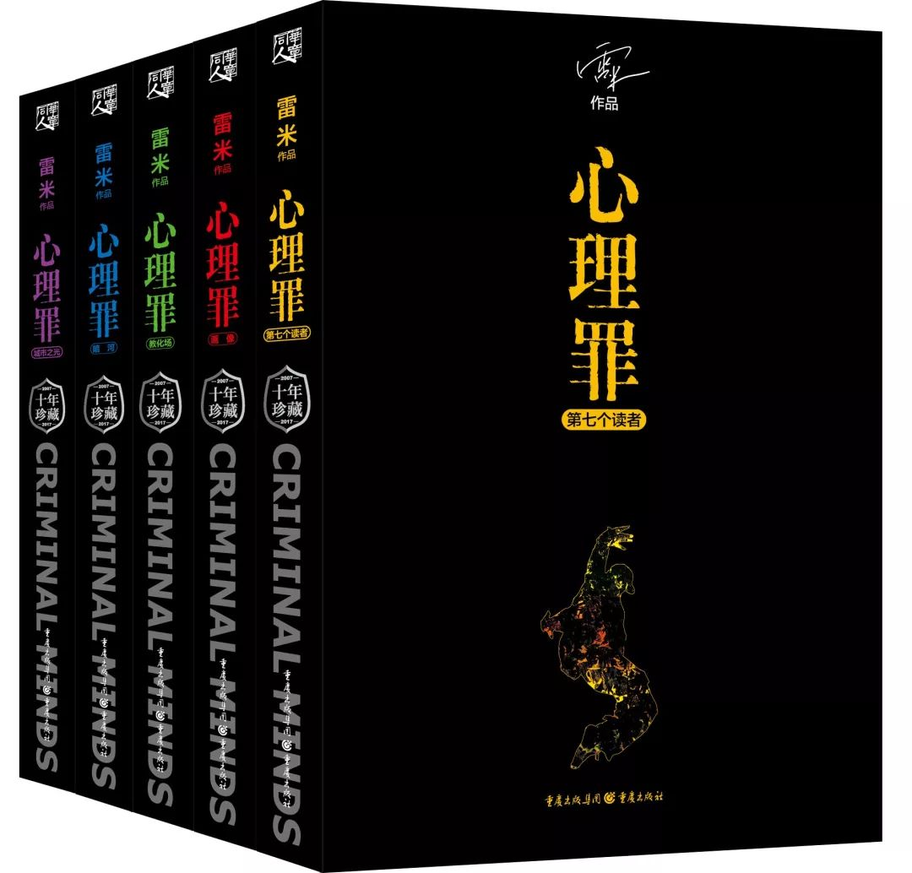

# 心理罪系列解读——《序》

<!--more-->

心理罪是我入坑推理小说的开始。起初我对推理小说并没有很大的兴趣，接触到心理罪也完全是一个意外，我最先接触的是于15年和16年上映的心理罪网剧（现在已经被和谐）。当时我还是一个追剧少年，喜欢看各种剧，恋爱类、搞笑类、治愈类和推理悬疑类。每天追着各种剧，当时比较喜欢的是美人为馅、余罪、无罪之证、白夜追凶等（这些可能是在心理罪网剧之后吧），当给我留下印象最深的就是心理罪。只是当时比较喜欢看剧，对于心理罪的原著并未仔细的了解。在18年初时我曾经入手过一套心理罪的原著，是最开始的那一套，番外还附在书的后面。当时真的是看的如痴如醉，从此也开始了我的阅读之旅。

我的本职是一名即将升入研究生的软件工程专业的学生，也就是大家口中的“程序员”，每天大部分时间都在和代码打交道。之前的追剧便是我除却编程以外的为数不多的爱好。之前看过的实体书籍也都是些专业的数据，有些很枯燥无聊。但我依旧喜欢阅读实体书籍，仿佛书拿在手上，就能感知到它的灵魂一样。我曾经不止一次的尝试过使用kindle或者ipad阅读，但到最后还是放弃了。当我想看什么书时，还是会从商店或网上买一本（套）实体书回来，找一个闲暇的时光，静静地品味书中文字的魅力。

我始终认为读书是一件需要全身心投入的事情，那些利用碎片时间来阅读的行为总觉得有些怪异，反正我是不太赞同。书中（特别是推理累的小说）是有大量的细节需要你去发现并思考的，而不仅仅是读一个故事。如果你只是想“读一个故事”，那当我没说。但让我诧异的是为什么你要选择推理类的小说来当做这个“故事”，因为好的故事真的有很多。我有一个朋友他很喜欢阅读，他的周围充满了书，但他从来不看推理类的书籍。可能就是这个原因吧。

就在最近，我新买了台nas，所以想着将一些珍贵的资料整理一下。在我的影片文件夹里我发现了那两部被我提前下载的心理罪，所以边重温了一遍故事。但令我不安的是，我总会不由的将影视剧中的剧情与原著的剧情进行比较，可我几乎已经忘了原著的剧情，那套书也早已送给了我同样热爱读书的姐姐。于是我便计划着再买一套回来，这次一定要好好的重新感受这个“故事”。令人惊喜的是不知何时竟然出了心理罪的10周年珍藏版，我便立即买了一套。里面的内容很丰富，有五本原著、四本单独封装的番外，还有雨伞、海报、明信片等等很多周边，感觉还是物有所值，唯一遗憾的是在海报中没有心理罪网剧的出现，可能是被和谐的原因吧。

这个系列的出现，一方面是为了更好地阅读这套“巨作”，我会将我的感受记录下来，为自己也为他人提供一点我自己的见解。另一方面，作为我开始全新生活的开始，我会尝试去阅读、去记录、去感受我从未感受的事物，而不是仅仅每天在电脑前一直忙碌的学习着。人之所以活着，便是为了感受美好吧。

在这个系列中，我的计划是采用两种形式来记录我的感受。第一个是心理罪原著及番外的具体阅读感受，我会把我的感受完完整整的记录下来。第二个是心理罪网剧与原著的比较。我个人认为网剧拍的很不错，有许多点改编的很好。两部作品可以比较，从中体会不同表现方法所带来的魅力。至于那两部电影，我觉得没什么好说的，从评分上便能了解到我对它们的态度。也正因如此，我才对十周年的海报有些失望。

网剧由于被和谐的原因，目前在主流的视频平台上已经看不到了，但想看的人一定会有办法看到。至于原著，大家想了解可以去书店或者网上商城看看。当然如果你是一个电子书爱好者，那么也可以在网上找到相关资源，前提是你要能接受错别字，因为那确实很让人不爽。

如果你是一个从来没有阅读过心理罪原著的读者，那么我会给你推荐以下几种阅读顺序：

1. 如果你想阅读一个完整的“故事”：

  《第七个读者》-《毒树之果》-《画像》-《斯纳金之箱》-《教化厂》-《月光的谎言》-《暗河》-《城市之光》-《两生花》

2. 如果你想初步感受悬疑的魅力：

   《毒树之果》-《画像》-《斯纳金之箱》-《教化厂》-《月光的谎言》-《暗河》-《城市之光》-《两生花》-《第七个读者》

3. 如果你想真正体会悬疑的魅力：

   《第七个读者》-《画像》-《教化厂》-《暗河》-《城市之光》-《毒树之果》-《斯纳金之箱》-《月光的谎言》-《两生花》

4. 如果你想跟随雷米的脚步，将这个系列改变为“巨作”：

   《画像》-《教化厂》-《暗河》-《城市之光》-《第七个读者》-《毒树之果》-《斯纳金之箱》-《月光的谎言》-《两生花》

心理罪系列的四部番外是雷米在正文写完后进行的补充，它们将心理罪的故事填充，使之形成一个完整的故事。其实这个系列关于阅读顺序最大的争议就在于这四个后补充的番外篇，正是通过这四个番外将人物性格补充完整，也正是这四部番外的加入，才让心理罪系列丛书有了被称为“巨作”的资格。

在阅读番外之前，我对这部小说还是抱有一些自己的看法。因为在宣传中经常会提到，这部书中的角色没有善恶之分。我对此其实抱有疑问。因为在现实中这就是常态，那些善恶对立分的很明白的各种类型的作品在我看来不过是安慰自己的心灵鸡汤。我们需要这种“自我安慰”来度过内心的困境，所以在面对那些作品时我会以善意的角度与欣赏。但在现实中，并不是非黑即白，而是二者勾勒的一种灰色的世界。如果现实类作品连这块灰色的世界都无法勾勒出来的话，那么他在我看来与垃圾桶中的垃圾无异。而心理罪的宣传让我以一种更严格的眼光去感受这部作品，我想感受它的世界是不是真的如它“吹嘘”的那么真实。

在读完整部作品后，我承认，在我看来它没有过分宣传。整体的人物刻画让人觉得很真实，我并非科班出身的专业人士，仅仅是以我的经历来感受这部作品，我觉得整体感觉让我很有代入感。我能感受到里面人物的情绪，从而能理解到他们的一些行为。虽然很多我没有经历过，但是我觉得不管从哪个方面来讲我可以理解他们的行为。但总归是有一点点缺失，有些人物的刻画还没有深入骨髓。就好像真实世界是“50度灰”，但在书中我感受到了“49度”。我承认我在吹毛求疵，但这么一部优秀的作品你无法不对他要求严格。

终于，我读完了番外。那种感觉怎么形容，好像是如释重负，毕竟书中的主基调还是很压抑的。这也说明了我们为什么需要那些善恶分明的书，因为真实，往往残酷的可怕。不过番外的加入终于让我感觉结束了，真的结束了。番外的故事，不仅将时间线补充完整，更是将一些人物的性格进行深入的刻画。那些人物由偏向“黑”的灰变成了真正的灰。在读完番外后，我是失望的，真的，然后我就明白了，这就是现实，残酷的现实。那些你希望的结局，其实就是一个笑话，自己骗自己的笑话。

我之所建议番外在最后阅读，是因为它其中包含了太多的关键信息，这些信息足以让你将整个故事串联个大概。这样对于理解故事是很方便的，但对于推理小说，却是很无趣的一种方式。以上帝视角去观察证件事情其实是很无聊的。这就不得不提到我很喜欢的一部国产电影——《心迷宫》。以书中人物的视角去看待每一个事件、去收集线索、去推理、去猜测，我觉得才是推理小说的魅力所在。等到真相大白时带来的成就也好、诧异也好，都会给你带来更深入的思考与感悟，我觉得这才是推理小说的魅力。其实你推理的过程，就是在与作者斗智斗勇的过程。当然，这只是我个人的建议，阅读这种与个人习惯密切相关的事情确实无法统一，大家看看就好。

长篇大论了这么久，不是说这个故事完美无缺，它还有很多瑕疵，但正是因为这些瑕疵，让我觉得它很“完美”，很真实。当然，包括阅读在内的任何一种形式也好，都会因人而异。有的喜欢这种，有的喜欢那种。不过我是真的喜欢心理罪，所以我把我的感受写下来，分享给大家。希望与我有相同感受的人看到后，会回想起当时阅读是那种幸福的感觉，即使这个故事让人很难过。

当然，上述感受都只是在我第二次看完网剧时的感受。现在十周年珍藏版已经收到，我会重新去感受这个故事并和大家分享，也许当我将这个故事重新阅读后，会有不一样的感受。到时我会再将这篇姑且叫做“序”的文章来重新修订吧。

*作者：vili*

*记于2019年11月17日*

