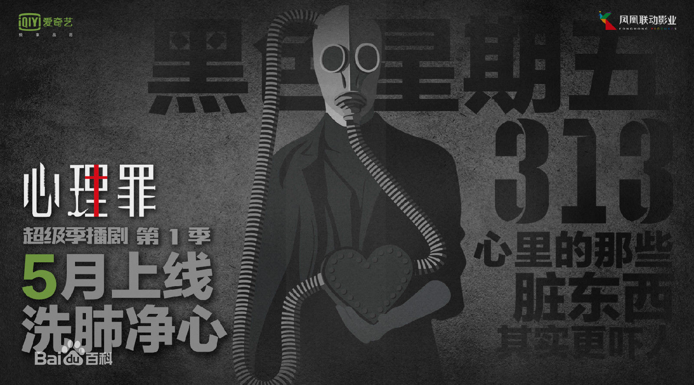

# 心理罪网剧系列解读之《第七个读者》

在动笔之前想了好久，应该怎么总结故事线。今天将《第七个读者》重温了一遍，发现改编的地方还挺多的，所以目前就计划按照网剧的叙事顺序来，与原著不同的地方我会进行对比，改动过大的地方我会单独列出来和大家分析。

首先和大家分析的是我觉得网剧中一个比较重要的改编点：方木的心魔。在网剧中，第一季剧情推动的关键就是方木的心魔，关于这一点我在《画像》中会和大家再详细的分析，第一季推动剧情的关键就是解除方木的心魔，所以将《第七个读者》的故事插入在这个过程中，即向大家解释了方木心魔的由来，又将两个故事完美融合。在原著的安排中，《第七个读者》虽然作为前传，但却是最后一部出版的作品。雷米也曾经说过，《第七个读者》更像是故事线的最后一笔，将整个心理罪的故事化成了一个圆圈，也象征着这个故事的完结，所以在原著中，你很难看到你在其他故事中已经熟悉的角色，因为他们都还未出场。但是在网剧中，《画像》和《第七个读者》更像是一个故事的延续，让没有看过后续的人也可以很好地融入到这个故事中，这是我觉得网剧中一个比较不错的点。

但可惜的是，网剧的改编依旧逃不过影视剧固有定特点——“主角光环”，在《第七个读者》的原著中，方木怂的一塌糊涂。但影视剧中却将许多情节“安排”给了他，这就让人们对“犯罪心理”这个本来就玄之又玄的词产生了那个固有的想法——这不是推理，是算命，是“法术”。即使安排了许多推理的情节想极力的表达出这并不是“算命“，但主角的个人素质（专业，年龄，心里承受能力）真的就不合适，强加反而让人觉得更加画蛇添足。

其次就是为了使两个故事衔接的更加完美，将人物的情节进行了更改，其中最大的改变就是引入了“邰伟”。邰伟的加入和主角光环的刻画使得原著中的许多任务的情节开始被转移，其中改变最大的就是删除了人物“丁树成”（他的戏份被重新分割）以及弱化了“刑志森”的剧情。这就导致第一季整体完结后给人的感觉刑志森就是一个标准体制中的领导者，并没有渲染他的业务能力，从而容易引起观影者的偏见。反倒是邰伟，因为他的性格获得了我很大的好感，有勇有谋，粗中有细。

其他细节方面的改动有很多，情节的改动，场景的改动，人物改动等等。下面就和大家一起来分享一下我的感想。

故事（第七个读者这个故事，大概在第六集的结尾）一开场，是一个很长的镜头，应该是开学典礼吧，或者是毕业庆典。用一个镜头将在这个故事中出场的人物都展示给了观众：陈希，方木的路人室友，吴涵，周军，孙梅，廖亚凡，王建，方木，祝老四，佟倩。同时用一个表白事件将基本的人物关系介绍清楚——祝老四在兄弟们的帮助之下要和数学老师佟倩表白，被抓后周军为兄弟独自揽下责任，事后众人在寝室庆祝，周军得知吴涵买酒怒斥祝老四。通过这一段的表达，即为祝老四对佟倩的感情埋下伏笔，同时将人物的性格也进行了初步的刻画——兄弟之间的情谊和每个人的性格，周军的热情，吴涵家境不好却很大度，祝老四的怂等等，可以说是一个很重要的情节，为以后的展开做了很好的铺垫。而在原著中则没有这些场景的出现，我觉得一方面是要靠文字来描绘这样一个场面需要很多的文笔，而且通过后续文字的铺垫来展现。而影视剧通过一个几分钟的叙事便能表达清楚，而且这样的情节作为两部作品之间的过渡剧情能更好的融合两部作品同时能快速的展现人物性格，将观众的情绪代入其中。但不管如何评论，我觉得这都是很亮眼的一点，改编的很灵性。

接下来的故事后续与大家分享，这次就先到这里了。

*作者：积极向上小木木*

*记于2019年11月20日*

