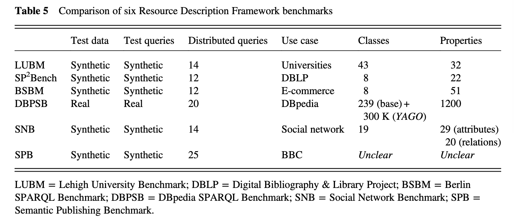

# RDF存储论文阅读笔记

[toc]

## Towards Massive RDF Storage in NoSQL Databases:A Survey（2019）

### 一、.RDfF模型和RDF数据存储

#### 1.1 集中式存储

rdf存储建议分类：

1. 本地存储：使用定制的二进制RDF数据表示
2. 关系存储：将RDF数据分发到适当的关系数据库

从关系、实体和基于图的三个基本视角来看，将RDF数据存储的建议分为三大类：

1. 关系存储
2. 实体存储
3. 基于图的存储。

根据硬件进行分类：

1. 基于内存的本地存储
2. 基于硬盘的本地存储

在RDF数据的关系存储中，可以设计不同的关系模式，主要分为以下三个模式：

1. 三元组存储
2. 关系存储（垂直存储）
3. 类型存储（属性存储）

三种模式的优缺点：

首先，三元存储使用固定的关系模式，因此可以处理RDF数据的动态模式，但是三元存储涉及许多用于查询的自连接操作。

其次，使用一组关系表的垂直存储通常涉及许多用于查询的表连接操作，并且不能处理RDF数据的动态模式，因为新插入的三元组的新谓词会导致新的关系表。

最后，与使用多个关系表的垂直存储相比，类型存储涉及的表连接操作更少，而且与使用单个关系表的三元组存储相比，类型存储不涉及自连接操作，但类型存储通常包含空值和多值属性，并且不能处理RDF数据的动态模式，因为新插入的三元组的新谓词会导致关系模式的更改。

|                  | 典型的存储系统                                               | 优点                                 | 缺点                         |
| ---------------- | ------------------------------------------------------------ | ------------------------------------ | ---------------------------- |
| 三元组存储       | Sesame (Broekstra, Kampman and van Harmelen, 2002); Hexastore (Weiss, Karras and Bernste, 2008) | 没有空值;没有多值属性;固定的关系模式 | 太多的自连接                 |
| 关系（垂直）存储 | SW-Store (Abadi, Marcus, Madden and Hollenbach, 2007 & 2009) | 没有空值;没有多值属性                | 表连接过多;动态关系模式      |
| 类型（属性）存储 | Jena (McBride, 2002); FlexTable (Wang, Du, Lu and Wang, 2010); RDFBroker(Sintek and Kiesel, 2006) | 很少有表联接                         | null值;多值属性;动态关系模式 |

本地RDF存储和关系RDF存储(包括三元组存储、垂直存储、类型存储和混合存储)实际上被归类为集中式RDF存储。

#### 1.2 分布式存储

通常，RDF数据的NoSQL数据库存储是分布式RDF存储。

根据采用的具体数据模型，RDF数据的NoSQL数据库存储分为：

1. 键值存储
2. 列族存储
3. 文档存储
4. 图数据库存储。

#### 1.3 总结

综上所述，我们可以将当前的RDF数据存储分为RDF数据的集中式RDF存储和NoSQL数据库存储（Papailiou等，2013）。集中式RDF存储可以进一步分为本地RDF存储和关系RDF存储，其中本地RDF存储包含基于主内存的本地RDF存储和基于磁盘的本地RDF存储，而关系RDF存储包括三重商店，垂直商店和类型商店。 RDF数据的NoSQL数据库存储进一步分为键值存储，列族存储，文档存储和图形数据库存储。图2说明了RDF数据存储的这种分类。

### 二、面向大数据的NoSQL数据库

大数据的三个特征：

- 体积：指大数据具有从TB到PB甚至更大的数据规模。
- 多样性：指大数据具有丰富的数据类型，具有多种格式，如结构化数据、非结构化数据、半结构化数据、文本、多媒体等。
- 速率：指必须快速处理大数据。此外，速度意味着大数据的产生速度很快。

后续新增的两个特征：

- 准确性:准确性是指明确考虑数据中固有的不精确性和不确定性，从而管理不精确性和不确定性大数据的可靠性和可预测性。
- 价值:价值意味着大数据必须是有价值的，并且对商业有价值。

此外还有一些特征，例如可视化和波动性。

关系型数据库管理的数据应具有ACID特征：

- 原子性（Atomcity）：如果部分操作失败，则整个操作失败

- 一致性（Consistency）：信息始终一致，不惜一切代价避免读/写错误

- 隔离性（Isolation）：多个事务在同一时间不会相互影响

- 持久性（Durability）：信息必须存储在数据库中，而不是在内存中排队

大数据管理需要CAP定理：

- 一致性（Consistency）：每当写入数据时，每个读取数据库的人都会看到最新版本。
- 可用性（Availability）：我们总是可以期望每个操作在预期的响应中结束。
- 分区容错性（Partition tolerance）：当部分数据库处于离线状态时，仍然可以对其进行读写操作;之后，当脱机节点重新联机时，将相应地更新它们。

NoSQL数据库的特点：

- 分布式处理
- 高可用性
- 高可伸缩性和可靠性
- 无方案
- 复制支持
- 处理结构化和非结构化数据
- 通过API访问数据
- 不严格遵守一致性
- 性能改进

NoSQL数据库的分类：

- **键-值对型NoSQL数据库**：键-值存储有一个基于键-值对的简单数据模型。
- **行型NoSQL数据库**：大多数列族存储来自谷歌BigTable (Changet al.， 2008)，其中数据以面向列的方式存储。在BigTable中，数据集由几行组成。每行都有一个主键寻址，并由一组列族组成。
- **文档型NoSQL数据库**：文档存储提供了键-值存储数据模型的另一种衍生物，该模型使用键来定位数据存储中的文档。大多数文档存储使用json (JavaScript对象表示法)或从json派生的某种格式来表示文档。通常，couchdb21和couchbase server22使用JSON格式存储数据，而mongodb23使用BSON(二进制JSON)存储数据。
- **图数据库**：图数据库使用图形作为数据模型，图形用来表示一组对象，称为顶点或节点，以及连接这些顶点的链接(或边)。

### 三、NOSQL数据库中的海量RDF数据存储

#### 3.1 在NoSQL数据库的列族存储中存储RDF数据

HBase数据库

- 首先，基于（Weiss，Karras和Bernstein，2008）开发的Hexastore模式的思想，在（Sun和Jin，2010）中提出了基于HBase的可扩展RDF存储。他们将RDF三元组存储到六个HBase表（S_PO，P_SO，O_SP，PS_O，SO_P和PO_S）中，这些表涵盖了RDF三元组模式的所有组合。他们使用HBase在行键上提供的索引结构来索引RDF三元组。
- 其次，基于HBase，分别在（Papailiou，Konstantinou，Tsoumakos和Koziris，2012）和（Papailiou等，2013）开发了两个分布式三元存储$$H_2RDF$$和$$H_2RDF+$$。 $$H_2RDF$$和$$H_2RDF+$$之间的主要区别是所维护索引的数量（3个对6个）。

对底层布局的操作包括以下内容：

- 格式化一个布局，即在保留表的同时删除所有三元组(图7中的Formatter块)。
- 将三元组加载-卸载到一个布局中(图7中的(Loader块)。
- 查询匹配给定<S, P, O>模式的三元组的布局(图7中的Query Runner块)。
- 其他操作包括维护一个HBase连接(图7中的Connection块)和维护每个RDF图的配置信息(图7中的Config块)。

这里有六种类型的布局是设计布局，它们是：

1. 简单布局
2. 垂直分区(VP)布局
3. 索引布局
4. VP和索引布局
5. 混合布局
6. 散列布局。

在简单布局中，创建了三个HTable表，每个表都按主题、谓词和对象(即行键)建立索引，其他两个组件组合在一起作为一个列名。

在垂直分区（VP）布局中，每个唯一谓词都会创建两个HTable表，并且每个表都由主题和对象索引。 

在索引布局中，创建了六个HTable表以表示三元组的六个可能组合，即SPO，SOP，PSO，POS，OSP和OPS。

在VP和索引布局中，垂直分区(VP)布局和索引布局被组合在一起。因此，VP和索引布局包含垂直分区布局中的所有HTable表，以及针对SPO、OSP和OS的三个额外的HTable表。

在混合布局中，简单布局和垂直分区的布局组合在一起。因此，混合布局包含简单布局中的三个HTable表以及垂直分区布局中的所有HTable表。

哈希布局是一种混合布局，具有节点的哈希值和包含哈希到节点映射的单独表。

实验比较这六个布局的数据加载速度和查询效率的特征，最后表明混合布局具有更好的性能。但是混合布局在设计和实现上很复杂。

#### 3.2 将RDF数据存储在NoSQL数据库的文档存储中

NoSQL数据库的文档存储类似于关系数据库，其中每一行都与文档相关联，而不是与元组相关联。显然，这种结构适合于存储半结构数据。

众所周知，RDF三元组包含三个组成部分，分别是主语，谓语和对象，而JSON的结构仅包含两个组成部分，即键和值。显然，它们是不一致的。因此，有必要建立一个将RDF转换为JSON的映射。基本上，我们可以确定从RDF到JSON的几种基本映射，如下所示：

1. Triple-centered mapping
2. Subject-centered mapping
3. JSON-LD approach

#### 3.3 在图数据库中存储RDF数据

为了使用Neo4j管理海量RDF数据，可以采用两种基本的方法。

- 首先，可以扩展Neo4j并为其提供处理RDF数据的接口，此时，RDF数据实际上存储在本机或关系存储中。
- 其次，大量的RDF数据可以直接存储在Neo4j中。按照第二种方法，将DBpedia数据存储在Dbpedia4neo项目的Neo4j中，并进行SPARQL（简单协议和RDF查询语言）查询，然后研究一些图算法。

#### 3.4 在NoSQL数据库中存储特殊的RDF数据

传统上，时态数据是在关系数据库中管理的。随着NoSQL在大数据可扩展性和存储方面的普及，为了管理随时间变化的大数据，许多研究工作都投入到NoSQL数据库中的时态大数据管理上（Monger、Mata Toledo和Gupta，2012；Cuzzocrea，2015）。

为了存储时态大数据，NoSQL数据库有两大类，分别是面向列的NoSQL数据库（Hu和Desloch，2014和2015）和面向图的NoSQL数据库（CastellCort和Laurent，2013）。

此外，在（Brahmia，Brahmia，Grandi and Bouaziz，2016）中，提出了一个称为时态JSON模式（τJSchema）的框架来定义时态JSON模式。在此基础上，可以管理基于时态JSON（面向文档）的NoSQL数据库。

在（Gutierrez，Hurtado和Vaisman，2007年； Hurtado和Vaisman，2006年）中提出了一个临时的RDF模型，其中包含时间RDF三元组。时间三元组的形状为（s，p，o）：[ts，te]，其中（s，p，o）是RDF三元组，[ts，te]是时间间隔。在此，（s，p，o）：[t1，t2]表示这样的事实，在时间间隔[ts，te]，三元组（s，p，o）是有效的。

在(Pugliese, Udrea和Subrahmanian, 2008)中，提出了规范化tRDF数据库的概念，其中时间RDF数据库由一组时间注释的RDF三元组组成，其形式为(主题，属性:注释，对象)。然后，我们有三种形式的时间RDF三元组：（s，p:{T}，o），（s，p:\<n:T\>，o）和（s，p:[n:T]，o），其中p:{T}表示tRDF三元组在时间点{T}有效，p:<n:T>表示tRDF三元组在T中至少在n个不同时间点有效，p:[n:T]表示tRDF三元组在T中最多在n个不同时间点有效。

除了时间特性外，现实世界中的事物通常还具有空间特性，随着时间的流逝，空间特性可能会进一步改变。这意味着我们确实还需要管理空间数据和时空数据。一些努力致力于使用NoSQL数据库处理大型时空数据（例如（Tear，2014），（Orrù等人，2017）和（Detti等人，2017））。在RDF数据的背景下，已提出并研究了空间RDF数据（Liagouris，Mamoulis，Bouros和Terrovitis，2014年； Shi，Wu和Mamoulis，2016年）。时空信息（即时空信息）均采用RDF建模（Hoffart，Suchanek，Berberich和Weikum，2013年; Kyzirakos等人，2013年; Wang，Zou和Zhao，2014年; Smeros和Koubarakis，2016年）。

模糊RDF实际上就是模糊三元组。在模糊三元组中可以识别出两个层次的模糊性，分别是三层次模糊性和元素层次模糊性。三层模糊RDF模型形式上是一个四元组(s, p, o) [μ]，其中n是0到1之间的数值。我们知道，三元组(s, p, o)包含三个成分(元素)。因此，三元组的元素级模糊性可以进一步确定为整个三个元素的模糊性和三个元素的一部分的模糊性。在（Ma，Li和Yan，2018）中，模糊RDF三元组形式上是模糊三元组（μs/ s，μp/ p，μo/ o），其中s是模糊主体，μs∈[0，1]表示RDF数据集的宇宙主体的度，p是模糊谓词，μp∈[0，1]表示所描述的性质或关系的模糊度，o是模糊对象，μo∈[0，1]表示属性值的模糊度。在(Ma and Yan, 2018)中，模糊RDF三元组形式上是一个模糊三元组(s, p， (o， μ))，即主体s具有属性pand p进一步具有隶属度μ的价值o。更重要的是，对模糊RDF数据到关系数据库的正式映射问题进行了研究(Ma and Yan, 2018)。人们认为，在NoSQL数据库中存储大量模糊RDF数据对于大规模模糊RDF数据管理是必不可少的，但迄今为止还没有关于这一主题的报告。

### 四、总结及未来工作

随着越来越多的RDF数据变得可用，对大规模RDF数据进行有效且可扩展的管理变得越来越重要。 NoSQL数据库设计用于存储和处理大数据数据集，并且由于云数据管理的可伸缩性和高性能，大规模的RDF数据管理值得使用大数据基础架构。在本章中，我们提供NoSQL数据库中海量RDF数据存储中最新技术的最新概述。 RDF数据管理是一个非常活跃的研究领域，并且在这个领域有很多研究工作。本章从三个主要角度介绍了该调查，分别是NoSQL数据库中RDF数据的键值存储，NoSQL数据库中RDF数据的文档存储以及图形数据库中的RDF数据存储。请注意，本章仅专注于NoSQL数据库中的海量RDF数据存储，而没有讨论索引和查询NoSQL数据库中的海量RDF数据的问题。

RDF数据管理通常涉及RDF数据的可伸缩存储和高效查询。另外，为了更好地服务于给定的查询，需要对RDF数据建立索引，这对于大规模RDF数据尤其如此。 NoSQL数据库中的RDF数据存储为大规模RDF数据管理提供了基础结构。当前，一些工作集中在基于云计算的大规模RDF数据查询上（例如Garcia和Wang，2013年; Husain等人，2010年和2011年; Kim，Ravindra和Anyanwu，2013年; Li等人，2013年）。应当指出，基于NoSQL数据库的RDF数据管理直到最近才获得发展，并且对此方向的研究还处于起步阶段。数据管理社区和语义Web社区都面临许多研究挑战和许多有趣的研究机会。 在这里，我们强调未来研究的几个主要方向。

1. 首先，随着云环境下RDF空间之外的大数据的NoSQL方法的成功，一个主要的研究方向是研究和开发NoSQL数据库中RDF数据的更丰富的结构化索引技术和相关的查询处理策略。
2. 其次，除了在标准RDF查询语言SPARQL(简单协议和RDF查询语言)中选择查询类型之外，还应该研究NoSQL数据库如何很好地支持其他类型的SPARQL查询，如CONSTRUCT、ASK和DESCRIBE。
3. 最后，为了在RDF应用程序操作的多样性(例如，计算生物学(Anguita et al.， 2013)和地质信息系统(Garbis et al.， 2013))的背景下进行大规模RDF数据管理，需要在NoSQL数据库的基础上开发新的RDF数据存储结构和查询策略。

## Storing massive Resource Description Framework(RDF) data: a survey（2016）

### 一、资源描述框架数据模型和资源描述框架数据存储

RDF数据存储分为两种不同的层次:

1. 逻辑存储
2. 物理存储

### 二、资源描述框架存储在传统的数据库中

#### 2.1 面向对象数据库

通过将三元组和资源映射到Bonstromet等人的对象中，RDF数据存储在面向对象的数据库中。 （2003）。提出了一个面向对象的数据库模型来存储RDF文档（Chao，2007a，2007b），但是RDF文档是用XML（可扩展标记语言）编码的

#### 2.2 关系数据库

垂直存储：也称为三元组存储。

水平存储：RDF三元组的每个谓词都直接表示一个主体-对象关系，一个谓词是一个列名。

属性存储：其中为每种RDF数据类型创建一个关系表，一个关系表包含相同主题的不同表列的属性。

类型存储方法实际上是两种水平存储之间的权衡。与使用单个关系表的水平存储相比，类型存储包含的空值更少（使用多个关系表的水平存储中没有空值），并且与使用多个关系表的水平存储相比，涉及的联接操作更少（使用单个关系表的水平存储中没有联接操作）应当注意，就像使用单个关系表的水平存储一样，类型存储可能包含多值属性和新的谓词，从而在插入新的三元组时导致关系模式的更改。

##### 2.2.1 垂直存储（三元组存储）：

垂直存储（也称为三重存储）使用单个关系表来存储一组RDF语句，其中关系模式包含用于对象，属性和对象的三列。形式上，每个三元组（s，p，o）在关系表中都作为一行出现，即tuple <s，p，o>。在这里，主题放置在该行的列主题中，谓词放置在该行的列属性中，而宾语放置在该行的列对象中。由于垂直存储迅速遇到可伸缩性限制，因此提出了几种方法来解决这些限制，方法是使用大量索引集或通过使用选择性估计信息来优化连接顺序。

Sesame是一种用于存储和查询RDF和RDF模式的通用体系结构，由Broekstraet等人介绍。 （2002）。 Sesame体系结构的一个重要功能是从用于实际存储的任何特定存储库的详细信息中抽象出来。因此，可以将Sesame移植到各种不同的存储库中。 Sesame的实现（Broekstraet等，2002）使用PostgreSQL和MySQL作为数据库平台。

Weisset等人提出了一种称为Hexastore RDF的RDF存储方案。 （2008）。该方案增强了垂直分区的概念，并将其逻辑上得出结论。 RDF数据以六种可能的方式编制索引，三种RDF元素的每种可能排序方式之一。 RDF元素的每个实例都与两个向量相关联。每个这样的向量收集其他类型之一的元素，以及附加到每个向量元素的第三种资源类型的列表。因此，出现了六元组索引方案。这种格式可实现快速和可扩展的通用查询处理；与以前的RDF数据管理方法相比，它具有显着的优势（最多五个数量级），但代价是索引空间增加了最坏情况下的五倍。请注意，Hexastore专注于对成对的三对位置（如SP，SO，...，OP）进行详尽索引。与Hexastore不同的是，RDF-3X专注于穷举性索引所有三元组的排列，例如SPO，SOP，...，OPS和TripleT（Wolffet等人，2015）专注于所有单个位置S，P的详尽索引和O。

##### 3.2.2 水平存储

在水平表示下，RDF数据可以直接存储在单个表中。该表为RDF图中出现的每个谓词提供一个列，为每个主题提供一个行。形式上，对于三元组（s，p，o），对象放置在columnpof行中。

Note that for two triples, say (si, pi, oi) and (sj, pj, oj), one may have si = sj and either pi = pj or pi≠pj. At this point, if si = sj and pi≠pj, oi and oj are placed in different columns pi and pj of the same row. However, if si = sj and pi = pj, oi and oj are placed in the same column of the same row, and a set of values {oi, oj} results. Of course, it is possible that si≠ sj and pi = pj. Then oi and oj are placed in the same column of different rows si and sj. It is very common that for any two triples (si, pi, oi) and (sj, pj, oj) in the context of massive RDF triples, they have different subjects and different predicates, and oi and oj are placed in different columns of different rows. As a result, row si has anull value in the pj column and row sj has a null value in the pi column. This will lead to a sparse table with many null values.

##### 3.2.3 属性存储（类型存储）

Jena是面向语义Web程序员的开源工具包（McBride，2002年）。它通过JDBC连接使用SQL数据库为RDF图实现持久性。耶拿已经从它的第一个版本Jena 1发展到了第二个版本Jena2。在Jena RDF中，谓词的分组由应用程序定义（Wilkinsonet等，2003； Wilkinson，2006）。应用程序通常具有访问模式，其中某些主题或属性可以一起访问。特别是，应用程序程序员必须指定哪些谓词是多值的。对于每个这样的多值谓词，将创建一个新的关系表，其表由主体和p组成。 Jena还支持所谓的属性类表，其中为rdf：type谓词的每个值创建一个新表。不在任何已定义组中的其余谓词将独立存储。

使用动态关系模型，提出了一个名为FlexTable的系统来存储RDF数据（Wanget等人，2010）。在FlexTable中，实例的所有三元组合并为一个元组，并且所有元组都以关系模式存储。为了将所有三元组划分为几个表，首先，提出一种基于格结构的模式演化方法，以在插入新的三元组时自动演化模式；其次，提出一种具有解释性存储格式的页面布局，以减少物理调整模式演化过程中的成本计算。

Jena是面向语义Web程序员的开源工具包（McBride，2002年）。它通过JDBC连接使用SQL数据库为RDF图实现持久性。耶拿已经从它的第一个版本Jena 1发展到了第二个版本Jena2。在Jena RDF中，谓词的分组由应用程序定义（Wilkinsonet等，2003； Wilkinson，2006）。应用程序通常具有访问模式，其中某些主题或属性可以一起访问。特别是，应用程序程序员必须指定哪些谓词是多值的。对于每个这样的多值谓词，将创建一个新的关系表，其表由主体和p组成。 Jena还支持所谓的属性类表，其中为rdf：type谓词的每个值创建一个新表。不在任何已定义组中的其余谓词将独立存储。Sintek和Kiesel（2006）引入了RDF商店RDFBroker，这主要是基于签名和签名表的概念，这些概念以类似格子的结构进行组织。请注意，Sintek和Kiesel（2006）的方法实际上创建了许多小表。为了提高查询评估性能，提出了各种标准来将小表合并为更大的表，但是当谓词不存在时，这会引入空值。

Matono和Kojima（2012）基于RDF文档结构，提出了一种存储方案，该方案存储RDF图而不进行分解。考虑到相邻的三元组具有很强的关系，并且可以针对同一资源进行描述，因此将一组引用相同资源的相邻三元组定义为RDF段落。然后根据RDF段落构建表格布局（Luoet等，2012）。

Levandoski和Mokbel（2009）提出了一种以数据为中心的模式创建方法，用于在关系数据库中存储RDF数据。为了最大化每个谓词组的大小并同时最小化表中出现的空值的数量，关联规则挖掘用于自动确定经常一起出现的谓词。根据测量RDF数据中属性之间的相关强度的支持阈值，在同一群集中分组在一起的属性可以构成一个单进制表，而在任何群集中未分组的属性可以存储在二进制表中。最后，在分区阶段，检查形成的集群，并在集群中存储尽可能多的RDF属性之间进行权衡，同时基于空阈值将空存储保持在最小。实际上，Levandoski和Mokbel（2009）的方法使用了元表和二进制表之间的平衡，为每个RDF数据集提供了量身定制的架构。

Matonoet等人将形式（主语，谓语，宾语）中的每个三元组分类。 （2005年）根据谓词的类型，然后为每个类别构造子图。根据谓词的类型将图分解为五个子图：类继承图，属性继承图，类型图，域范围图和泛型图。每个子图通过适用的技术存储到不同的关系表中。更准确地说，所有类和属性都是从RDF架构数据中提取的，所有资源也是从RDF数据中提取的。为每个提取的项目分配一个标识符和一个路径表达式，并将其存储在相应的关系表中。由于建议的方案保留了每种资源的架构信息和路径表达式，因此基于路径的关系RDF数据库（Matonoet等人，2005）可以有效地处理基于路径的查询，并存储没有架构信息的RDF实例数据。

##### 3.2.4 混合存储

除了RDF数据集的三个基本关系存储（即垂直存储，水平存储和类型存储）以外，还努力通过将两个或多个基本存储类型一起使用或修订这三个基本存储类型来存储RDF数据。实际上，例如，在Levandoski和Mokbel（2009）中，类型存储用于在同一群集中分组在一起的属性，而具有多个关系表的水平存储用于未在任何群集中分组的属性。

Kim（2006）提出了一种用于RDF数据管理的混合存储方案，其中识别了RDF数据中经常出现的属性。然后将具有一个或多个常用属性的RDF数据集物理分组并存储在相应的属性表中，将不重要属性的RDF数据分组到一个公共三元表中。表之间没有重复。为了处理具有特定或可区分属性的查询，可以通过仅访问相应的属性表来完成评估。

Sperka和Smrz（2012）使用了两种类型的关系表：类表和属性表。 类表的格式为iri（成员），其中iri是关系的名称，而member是唯一的属性。 类表包含类的成员，因此表的行由加载的三元组形式（any：iri1，rdf：type，any：iri2）给出，即，iri1成为表iri2中的一行。 属性表的结构为iri（主题，对象），其中iri是关系的名称。 当导入形式为（any：iri，rdf：type，rdf：Property）或（any：iri1，any：property，any：iri2）的三元组（其中any：property不是本体结构）时，将出现一个属性表。 属性或rdf：type，即系统未解释的IRI）。 当遇到表格（iri，iri2，iri3）的三倍形式时，将在表iri2中创建一行（iri1; iri3）。

Borneaet等人介绍了一种新的RDF存储和查询机制。 （2013）。 所提出的机制是在现有的关系表示之上工作的。 确定将RDF存储在关系数据库中存在挑战，包括数据稀疏性和模式可变性，Borneaet等。 （2013年）处理关系的列作为灵活的存储位置，这些位置没有预先分配给任何谓词，而是在插入过程中动态地为其分配了谓词。 分配确保将谓词始终分配给同一列，或更笼统地说是同一组列。

### 三、资源描述框架在NoSQL数据库中

rdf数据分区分类：

1. 水平（随机）分区
2. 哈希分区

为了应对大数据挑战，最近的研究开始转向分布式数据管理系统。这方面的第一次尝试是4store。4store将RDF数据存储为具有以下形式的四边形（model、subject、predicate、object），其中URI、文本和空白节点使用加密哈希函数进行编码。在分布式环境中定义了两种类型的计算节点。第一个是存储节点，存储实际数据；第二个是处理节点，负责解析传入的查询，并在查询处理过程中处理与存储节点的所有分布式通信。4store将数据划分为不重叠的部分，并根据主题的哈希划分来分配四边形。4store中的数据组织为属性表。YARS2（Harthet al.，2007）是一个本地分布式RDF处理系统，它使用简单的散列作为其三重分区策略，并在主存中构建一组六个稀疏索引，这些索引是RDF三重组件组合的集合。集群TDB（Owenset al.，2009）使用hashingonsubject、object和predicate将每个三元组分发到服务器集群三次。

在分布式RDF数据管理中，RDF数据分区是一个重要的问题。基本上，基于RDF数据集的分区方式以及分区的存储和访问方式，可以识别出两类现有的分布式RDF系统（Lee＆Liu，2013）。第一类通常使用水平（随机）分区在多个服务器之间划分RDF数据集。我们称其为水平分区。然后使用诸如Hadoop分布式文件系统（HDFS）19之类的分布式文件系统存储分区，并通过使用诸如Hadoop MapReduce之类的分布式编程模型对集群服务器的并行访问来处理查询。 SHARD将RDF三元组直接作为文本文件存储在HDFS中，并为SPARQL查询的每个子句（三元组模式）运行一个Hadoop作业（Rohloff＆Schantz，2011）。通过对谓词进行哈希处理，将RDF三元组存储在HDFS中，并且系统为每个SPARQL查询中的联接运行一个Hadoop作业（Husainet等人，2011年）。同样使用HDFS，Husainet等人提出了一种存储框架。 （2009）存储RDF数据，然后基于建议的存储模式，使用Hadoop的MapReduce框架检索RDF数据。已经探索了MapReduce框架以可扩展地处理RDF数据。 Zhanget等人使用了MapReduce。 （2012a）在大型RDF图上进行有效的连接处理，以尽可能减少查询响应时间。为了优化MapReduce上的RDF图形模式匹配，Ravindraet等人提出了一个嵌套的TripleGroup数据模型和Algebrawas。 （2011年）为在云中有效的图形模式查询处理，并通过使用扫描共享技术进一步扩展了这项工作，该技术用于优化具有重复属性的图形模式的处理（Kimet等人，2012年）。

第二类使用RDF三元组的主题，对象和谓词或它们的任意组合，对哈希节点进行跨多个节点的RDF数据集分区。我们称其为哈希分区，然后将分区本地存储在数据库中，例如HBase之类的键值存储或RDF-3X之类的RDF存储，并通过本地查询接口进行访问。与上面描述的水平分区不同，哈希分区依靠诸如Hadoop MapReduceonly之类的分布式计算框架来执行跨服务器协调和执行分布式查询所需的数据传输，例如来自两个或更多分区服务器的中间查询结果的联接。

特别是，与RDF数据分区相对应，必须考虑访问在服务器之间分区的RDF triple的问题。首先，即使某些分区服务器出现故障，仍可以访问存储的分区。其次，有必要最小化分区服务器之间的通信。对于后者，集群分区已应用于RDF数据管理。 Virtuoso具有商业集群版，可以对其进行扩展。其他具有BigData和4store的系统。对于前者，复制是故障转移的有效方法。实际上，复制可以在本地存储分区，并减少分区服务器之间的通信。因此，基于复制的集群体系结构被设计为更好的查询可伸缩性和弹性。Lee和Liu(2013)提出了一种语义哈希划分方法，将基于方向的三重分组与基于方向的三重复制相结合，扩展了简单的哈希划分。由Facebook最初开发的Apache Cassandra（Lakshman＆Malik，2010）提供分散的数据存储以及基于复制和故障转移的容错能力。将RDF图划分为紧凑的子图，并将每个子图分配给一个主机（Huanget等人，2011）。使用分区边界处的复制，然后可以在所有分区上并行处理不超过特定直径的查询，而无需主机之间的进一步通信。注意，OWLIM只复制了集群。这意味着它不能在多个服务器上并行执行一个查询，也不能在多个相同的服务器上平衡多个查询的工作负载。

NoSQL数据管理系统已经成为处理RDF空间之外的大数据的常用基础设施。grolingeret al.(2013)将各种NoSQL数据存储划分为四大类:键值存储、列族存储、文档存储和图形数据库。键-值存储有一个基于键-值对的简单数据模型。大多数列族存储来自谷歌BigTable (Changet al.， 2008)，其中数据以面向列的方式存储。在BigTable中，数据集由几行组成。每行都有一个主键寻址，并由一组列族组成。文档存储提供了键-值存储数据模型的另一种衍生物，该模型使用键来定位数据存储中的文档。大多数文档存储使用json (JavaScript对象表示法)或从json派生的某种格式来表示文档。通常，couchdb21和couchbase server22使用JSON格式存储数据，而mongodb23使用BSON(二进制JSON)存储数据。图数据库使用图形作为数据模型，图形用来表示一组对象，称为顶点或节点，以及连接这些顶点的链接(或边)。

### 四、资源描述框架数据存储的基准测试

rdf基准测试分类：

1. 基础RDF基准
2. 扩展RDF基准

#### 4.1 基准测试

- LUBM是第一个考虑到大学领域的RDF基准测试之一。LUBM使用一个人工数据生成器为大学、院系、教授、员工、课程和出版物生成合成数据。此外，LUBM基准测试提供了14个测试查询，用于测试RDF存储的性能。
- BSBM基于一个电子商务用例，在这个用例中，一组产品由一组供应商提供，消费者发布关于这些产品的评论。为了测试RDF存储性能，BSBM基准测试附带了12个查询和两个查询混合(12个查询的序列)。
- SP2Bench基准测试使用数字书目与图书馆项目(DBLP)作为其领域，并生成模拟原始DBLP数据的合成数据集，包括关于出版物和作者的信息。SP2Bench基准测试附带12个查询。
- DBPSB从Wikipedia中提取结构化信息。数据集包含约1.5亿三倍（22 GB）（Duanet等，2011）。存储在三元组中的实体来自多种数据类型，包括“人物”，“电影”，“（音乐）专辑”，“地点”，“组织”等。然后，可以对存储在数据集中的各种实体评估各种查询，但是没有定义的代表查询集。

#### 4.2 扩展的资源描述框架基准测试

RDF数据管理系统很多，有必要在具有不同特征的数据和工作负载下对这些系统进行测试。已经开发了许多RDF基准测试来测试RDF存储的性能。RDF基准测试的重点主要是可伸缩性方面的RDF存储性能（即测试的RDF数据中的三元组数）。 基本上，RDF基准可以分为通用RDF基准和专用RDF基准，以下分别称为基础RDF基准和扩展RDF基准。

最有代表性和广泛使用的RDF基准是LUBM（Guoet等人，2005），BSBM（Bizer＆Schultz，2009），SP2Bench（Schmidtet等人，2009）和DBPSB（Morseyet等人，2011）。 ，BSBM和SP2Bench基于用例场景创建综合数据集，并定义一组涵盖一系列查询特征的查询。 DBPSB采用了不同的方法，并提出了基于实际数据和查询日志的基准创建方法。

关于上述RDF基准，Morseyet等人。 （2012年）对它们的主要特征发表了一些评论。 LUBM仅依赖于普通查询，而没有SPARQL功能（例如FILTER或REGEX），并且其查询策略（同一查询的10次重复）可容纳缓存。 BSBM数据和查询是人为的，并且数据模式非常相似并且类似于关系数据库。 SP2Bench依靠综合数据和小的（25 M三元组）综合数据集进行查询。

为了开发图形和RDF数据管理系统的行业强度基准，Linked Data Benchmark Council33最近制定了两个基准，即社交网络基准（SNB）34和语义发布基准（SPB）35（Angleset等，2014）。 SNBaims在三种情况下测试图形数据管理技术：交互（事务查询工作负载），商业智能（分析查询工作负载）和图形分析（图形分析算法，例如PageRank）。各种各样的系统可能潜在地执行SNB的一个或多个工作负载。当前，交互式工作负载处于草稿发布阶段，其他两个工作负载仍在开发中。 SPB基于BBC新闻网站，并通过有限的语义推断对混合查询和更新工作量进行建模。通过产生同时执行的CRUD（创建，读取，更新，删除）操作的工作负载来衡量SPB性能。

通过比较Morseyet al.(2012)中LUBM、SP2Bench、BSBM V2.0、BSBM V3.0和dbpsb2的基准，纳入SNB和SPB，这些基准的综合比较如表5所示。

各种RDF基准已用于评估现有RDF存储系统。 SP2Bench由Schmidtet等人使用。 （2008年）以实验方式比较了四种均依赖于物理关系数据库后端的RDF存储策略。 首先考虑的系统是芝麻引擎。其余的场景是三元表存储、垂直分区存储(Abadiet al.， 2007)和纯关系DBLP模型。Morseyet al.(2012)为SPARQL提出了一种基准创建方法，并应用于DBpedia知识库。然后使用生成的基准来比较几种流行的三层存储实现，包括Virtuoso、Sesame、Jena-TDB和BigOWLIM。

Cudre-Maurouxet al.(2013)使用了四个代表性的NoSQL商店(CouchDB、Hive、HBase和Cassandra)以及一个nativeRDF商店(4store)，在云基础设施上运行标准RDF基准(BSBM和DBPSB)时，对这五个商店的RDF处理进行了实证评估。每一个被评估的系统都有自己的优缺点。

除了通用的基本RDF基准之外，还开发了一些专门用于RDF数据管理的基准。例如，Minacket al.(2009)用合成的可伸缩全文数据和相应的查询扩展了LUBMbenchmark，用于全文相关的查询性能评估。RDF存储对基本的全文查询(经典的IR(信息检索)查询)以及混合查询(结构化和全文查询)进行了基准测试。

一般来说，为特殊应用程序的RDF数据管理提出了扩展基准测试。例如，为了处理链接流数据(LSD)， RDF数据模型被扩展为表示来自传感器和社会网络应用程序的流数据。Le-Phuocet al.(2012)提出了一个可定制的评估框架和相应的方法，用于真实的数据生成、系统测试和结果分析。基于提出的LSBench 平台，我们进行了大量的实验来比较各种最先进的LSD引擎，同时考虑到流处理的基本原理。同样对于RDF流处理，Zhanget al.(2012b)引入了一个称为SRBench的流RDF/SPARQL基准测试，目的是评估流RDF/SPARQL处理引擎在将语义Web技术应用到流数据中的能力。来自LOD云的三个真实世界的数据集(biizer & Schultz, 2009)被选择并在SRBench基准中使用。SRBench在Dell 'Aglioet al.(2013)中得到了扩展，随后开发了一个名为CSRBench的基准。应用CSRBench自动对查询结果进行正确性验证。

RDF数据模型也已扩展为表示从地理空间应用程序生成的空间数据。对于地理空间RDF存储，Kolas（2008）提出了一种查询以RDF编码的地理空间数据的基准，其中LUBM基准被扩展为包括空间实体并测试具有空间功能的RDF存储的功能。相应地，LUBM查询已扩展为涵盖四种主要类型的空间查询：空间位置查询，空间范围查询，空间连接查询和最近邻查询。实际上，在某些基准中已经考虑了地理空间约束，例如，在LOD2项目中开发的基准36。最近，Garbiset等人开发了地理空间RDF存储的基准，称为Geographica。 （2013）。 Geographica使用现实世界数据和综合数据来测试各种重要的地理空间RDF存储的功能和性能。实际工作负载使用覆盖广泛范围的几何类型（例如点，线，多边形）的公开链接的地理空间数据。

### 五、结论和未来工作

本文提供了有关RDF数据存储的最新技术的最新概述。本文的重点是存储大量RDF数据集。从调查中可以明显看出，RDF数据管理是一个非常活跃的研究领域，并且正在进行许多研究工作。本文从三个主要角度介绍了该调查：传统数据库中的RDF数据存储，NoSQL数据库中的RDF数据存储以及RDF数据存储的基准。请注意，由于纸张尺寸的限制，纸张仅集中在RDF数据存储上，而不讨论索引和查询RDF数据。

RDF模型为管理大量RDF数据提供了新的研究方向（Hassanzadehet al.，2012）。作为一个全新的研究领域，它为数据管理社区和语义网络社区提供了许多研究挑战和有趣的研究机会。RDF数据存储为RDF数据管理提供了基础设施。在此基础上，高效的RDF数据查询是非常有潜力的。对于查询大量RDF数据尤其如此。查询优化支持RDF数据的高效查询，它比查询执行更为重要。但是在SPARQL中查询优化并不容易，因为没有模式，因此星型模式中属性之间没有关联。Neumann和Moerkotte（2011）将特征集应用于RDF查询优化。此外，查询优化期间的索引采样（用于测试查询谓词的真实基数）以及启发式等技术对于SPARQLquery优化应该非常有用。除了RDF数据的查询优化外，本文还强调了三个主要的研究方向。

从调查中可以明显看出，为了应对大数据挑战，研究已经转向分布式RDF数据管理系统。结果，由于云数据管理的可伸缩性和高性能，NoSQL数据库中的RDF数据管理直到最近才获得发展。存储RDF数据的实际主题是RDF数据索引。 RDF数据管理中应用的大多数NoSQL数据库都是针对RDF空间之外的大数据开发的，对于给定的RDF结构和内容，它们的索引技术可能不足以允许使用不同类型的RDFusage方案。因此，随着云环境中RDF空间之外的大数据方法的成功应用，主要的研究方向是研究和开发更丰富的结构索引技术以及相关的查询处理策略。

RDF提供了一种表示和交换语义元数据的方法。推理是语义数据处理的基础。在RDF数据管理中加入推理，可以推断出新的事实，利用知识库中的属性语义和断言信息。因此，在许多使用场景中，rea-soning是任何RDF存储的一个重要特性。研究表明，RDF数据主要存储在传统数据库或NoSQL数据库中。然而，这两种数据库的推理能力都很弱。因此，另一个主要的开放问题是将RDFS（RDFSchema）和OWL（Web本体语言）结合到RDF数据管理中进行推理。目前，关于推理对RDF数据管理的影响的研究相对较少（Theohariset al.，2005；Salvadoreset al.，2010，2011；Bishopet al.，2012；Sperka&Smrz，2012）。Stardog和RacleRDFStore都支持最高级的OWL配置文件，但是它们的可伸缩性是有问题的。Urbanian等人（2009）的工作仅在概念上证明了可伸缩推理。OWLIM支持部分层次的推理，但仅仅是通过在导入时具体化这一点。Virtuoso对推理的支持很少，但它是在运行时完成的。这使它更灵活，更容易加载，但会使查询速度明显减慢。实际上，推理可以看作是一种重要的索引类型，最终影响查询结果的性能和完整性。

最后一个主要问题是性能和数据质量的基准研究。除了现有的RDF基准和广泛使用的真实RDF数据集中的数据外，还应该引入和应用更大规模的真实RDF数据集。在RDF应用的多样性（例如计算生物学（Anguita et al.，2013）和地质信息系统（Garbis et al.，2013））的背景下，RDF数据管理尤其如此。

