# DiStRDF论文阅读及实现思路分析

- 数据存储。数据存储是每个 RDF 引擎的一个组成部分。数据存储取决于存储格式、存储大小和存储格式支持的推理等因素[2]。最近的评估 [11] 表明，不同 RDF 图分区技术中 RDF 数据的存储对查询运行时间有重要影响。

- 索引。RDF 引擎中使用各种索引来实现快速数据查找和查询执行。更多的索引通常可以带来更好的查询运行时性能。然而，在空间消耗和保持更新以反映底层 RDF 数据集的变化方面，维护这些索引的成本可能很高。过时的索引会导致结果不完整。

- 查询语言。各种 RDF 引擎以不同的格式存储数据，因此支持各种查询语言，如 SQL [12]、PigLatin [13] 等。由于 SPARQL 是 RDF 的标准查询语言，许多RDF 引擎需要 SPARQL 转换（例如，SPARQL 到 SQL）来执行查询。这种语言支持会对查询运行时产生重大影响。这是因为这些查询语言中使用的优化技术可能彼此不同。

- 查询执行。对于给定的输入 SPARQL 查询，RDF 引擎生成优化的查询计划，该计划随后指导查询执行。选择最佳连接执行顺序和选择不同连接类型（例如，散列连接、绑定连接、嵌套循环连接等）对于快速查询执行至关重要。

定义 3（三重模式和基本图模式）假设有无限的成对不相交集 I（IRI 集）、B（空白节点集）、L（文字集）和 V（变量集）。那么，来自(I∪V∪B)×(I∪V)×(I∪L∪V∪B)的元组是一个三元组。带有可选过滤器的三重模式序列被视为单个 BGP。根据 BGP 的规范，任何其他图形模式（例如，UNION、MINUS 等）都终止于基本图形模式。

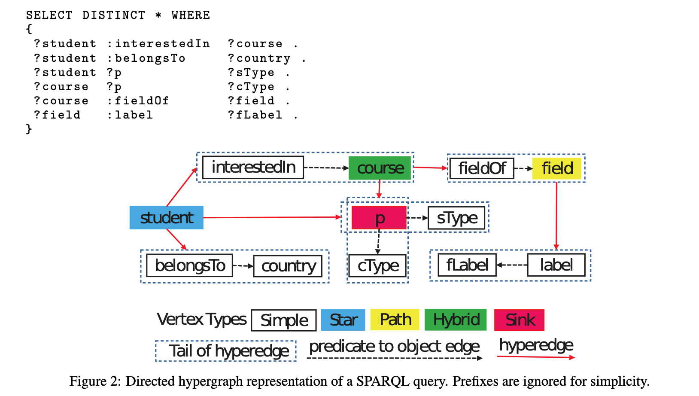

## 前言

数据存储是任何数据库管理系统 (DBMS) 的一个组成部分。高效的数据存储是 DBMS 的磁盘空间消耗、安全性、可扩展性、维护和性能的关键。本节回顾了集中式和分布式 RDF 引擎中常用的存储机制。我们将这些机制分为五个更广泛的类别（参见图 3），即三重表、属性表、垂直分区、基于图的数据存储解决方案，以及其他类别，包括键值、Hbase 表、内存中、位矩阵、作为索引排列的存储和系统使用另一个系统作为他们的存储组件。

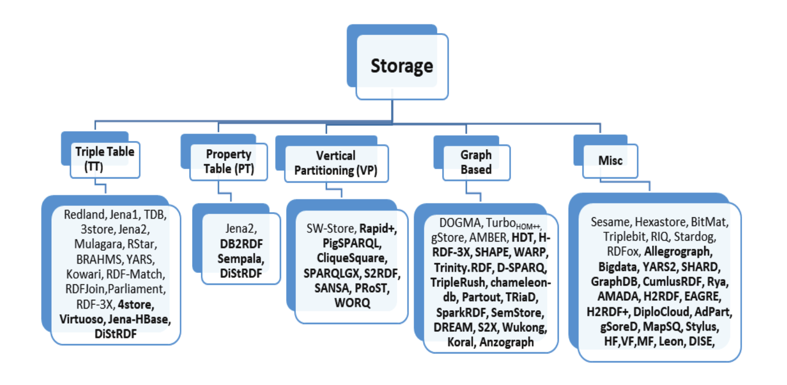

### 1. Triple Table

三重表 (TT) 是以关系样式保存 RDF 数据的最通用方法（参考第 9 节中的讨论）。此样式将其所有 RDF 数据存储在单个大表中。该表包含三列，RDF 三元组的主语、谓词和宾语各列一列。 表 3 显示了表 1 所示示例 RDF 数据集的 RDF 图形表示的 TT 表示。

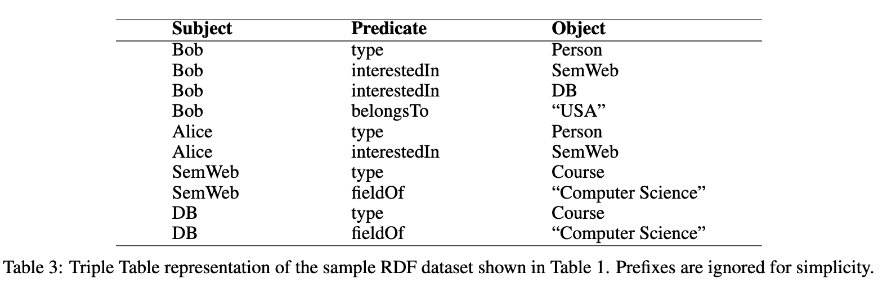

为了最小化存储成本并提高查询执行性能，TT 中使用的 URI 和字符串可以编码为 ID 或哈希值，并且可以维护单独的字典。例如，使用表 4b 中给出的非常简单的整数字典，表 3 中给出的 TT 表可以表示为表 4a 中所示的整数 TT。字典的使用对于具有许多重复 IRI 或文字的 RDF 数据集特别有用。

然而，在RDF数据集中，IRIs比文本更常重复。因此，编码每个不同的文本并分配字典id可能不必要地增加字典大小。因此，由于在查询执行期间额外的字典查找，这可能导致性能降级。为了解决这个问题，一些RDF引擎（例如jena2[33]）只使用字典表来存储长度超过阈值的字符串。一方面，这允许直接在TT上执行过滤器操作。但是，另一方面，由于字符串值被多次存储，这也会导致更高的存储消耗。

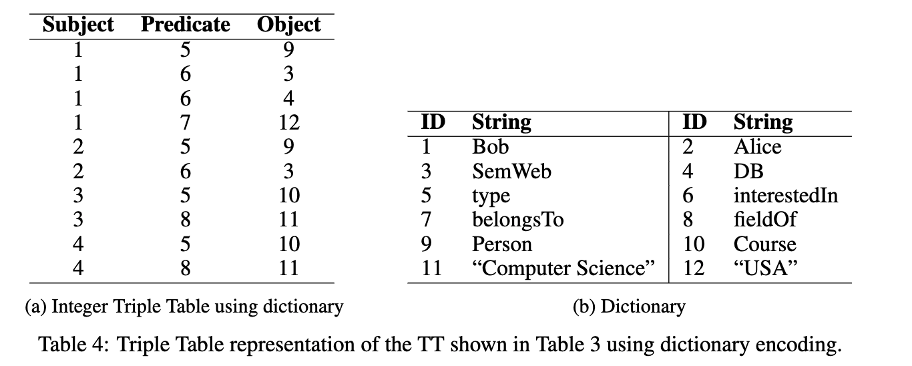

通常，RDF 数据集是 RDF 图的集合。因此，一个 RDF 数据集恰好包含一个默认图和零个或多个命名图10。每个命名图都是由 IRI 或空白节点（图名称）和 RDF 图组成的对。图名称在 RDF 数据集中是唯一的。 SPARQL 查询语言允许用户指定查询执行要考虑的确切命名图，从而跳过所有其他要考虑进行查询处理的命名图数据。由于每个 RDF 三元组都属于默认图或特定命名图，因此 TTstorage 可以利用此信息并将相应的命名图存储为每个输入三元组的第四个元素。 TT的这种特定表示也称为Quad，其中表包含四列； 3 用于存储三元组的主语、谓词和宾语，第四列存储给定三元组的相应命名图。根据 RDF 规范，命名图是 IRI。为简单起见，假设表 3 中给出的所有三元组都属于命名为 GraphG1，那么给定 TT 的 Quad 表示如表 5 所示。 Quad 表示已在许多著名的 RDF 引擎中使用，例如 Virtuoso [34] 和 4store [35 ]。请注意，根据 SPARQL 规范12，SPARQL 查询可以通过使用 FROM 子句和 FROM NAMED 子句来描述 RDF 数据集来指定要用于匹配的 RDF 图。使用Quad 表可以有效地执行此类查询；因为这样的查询应该在指定的命名图上执行，因此跳过属于其他命名图的三元组。

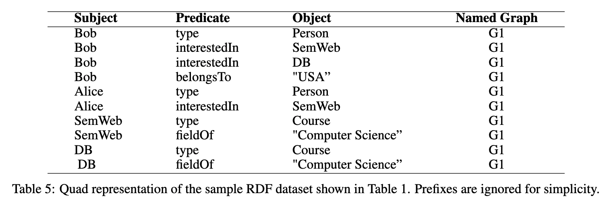

总结。TT 中使用的关系数据库存储风格节省了单独表之间的昂贵连接，但会导致昂贵的自连接。由于大量的自连接，包含在这种存储方式中应用的多个三元组模式的 SPARQL 查询执行速度很慢。因此，这可能不是用于存储大数据的可扩展解决方案。

对单个巨型表的查询执行也是次优的。这是因为整个数据集必须至少接触一次，即使查询仅针对表的最小子集。然而，这个问题可以通过在 TT 上使用多个索引来解决。例如，在第 9 节中，我们将看到 TT 通常伴随着一些或所有（六个）三重排列的多个索引 P(< s,p,o >) = spo, sop, pso, pos, ops, osp。

### 2.  Property Table 

属性表方法旨在减少 SPARQL BGP 评估所需的连接数量。在这种方法中，所有期望组合使用的属性（即谓词）都存储在一个表中。一个典型的属性表只包含一列来存储主题（即资源）和 n 列来存储给定主题的相应属性。例如，在表 1 所示的示例 RDF 数据集中，subjectDB 有两个属性，即 type 和 fieldOf，因此典型的属性表将包含三列：一列存储主题，两列存储相应的属性。

有两种方法可以确定在属性表中分组在一起的属性集：

1. 利用数据集本身中的类型定义。
2.  使用一些聚类算法来确定属性组.

我们在表 1 中显示的示例 RDF 数据集明确提到了 twordf:types 是Person类和Course。因此，我们可以将属于Person的所有属性分组在一个表中，将所有属于Coursere的属性分组在另一个表中。 表6显示了表1所示RDF数据集的相应属性表。

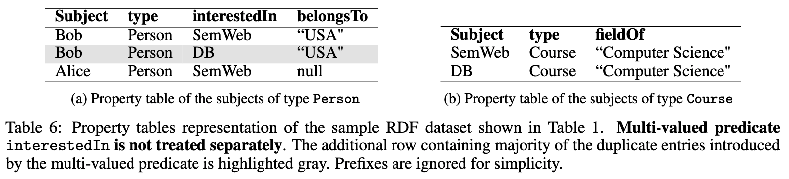

表6揭示了使用属性表的两个明显缺点：

- 多值属性：多值谓词在数据库中很常见。例如，一个人可以有多个联系号码。在我们的示例中，interestedIn 是多值谓词：Bobis 对 SemWeb 和 DBcourses 都感兴趣。典型的多值谓词会在列中引入重复信息。例如，在表 6a 中，主题Bob 的类型和国家（belongs To）信息是重复的。处理这个问题的一种方法是使用典型的数据库规范化方法，即为多值谓词创建单独的属性表。表 7 显示了在为多值谓词创建单独的表之后对应的属性表。

- 空值：在 RDF 中很常见某些资源缺少某些特定谓词信息的数据集。例如，资源Alice 的国家在表1 中缺失。这种缺失信息通常表示为空值。 [36] 中显示的低数据集结构值表明，许多真实世界的 RDF 数据集包含不同资源的缺失信息。

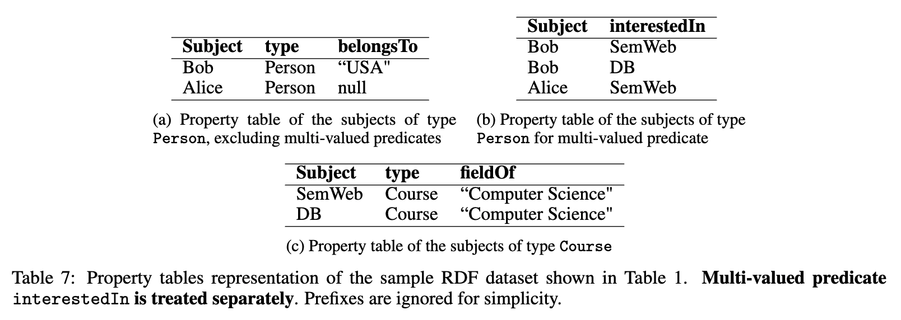

总结。PT在查询中执行星型连接（参见图2）的性能非常好。这是因为，星形连接节点基于主题-主题连接，因此典型的属性表将充当执行此类连接的基于主题的索引。然而，它在执行SPARQL查询中使用的其他类型的连接（如path、hybrid和sink）时会受到影响。路径连接节点是指主体-对象连接， 接节点是指对象-对象连接，混合连接节点是指所有连接的组合。[37]中给出的四个数据集的真实用户查询统计显示，33%的真实世界查询包含星型连接，8.79%包含路径连接，6.62%包含sink连接，4.51%包含混合连接，66.51%根本不包含连接。因此，这种方法可以为大多数包含三重模式之间连接的查询提供有效的结果。此外，不同的工具试图减少与PT相关的问题和性能缺陷。例如，在[33]中，PT与TT一起使用，其中PT的目的是存储最常用的谓词。最后，这种方法对RDF数据集中的底层模式或数据更改非常敏感。 

### 3.  Vertical Partitioning

垂直分割（VP）在[38]中提出。与PT和TT不同，VP以两列表的形式存储RDF数据。由属性命名的主题和对象。表的数量等于RDF数据集中使用的不同谓词的数量。由于表1所示的示例RDF数据集中有四个不同的谓词，相应的垂直表如表8所示。

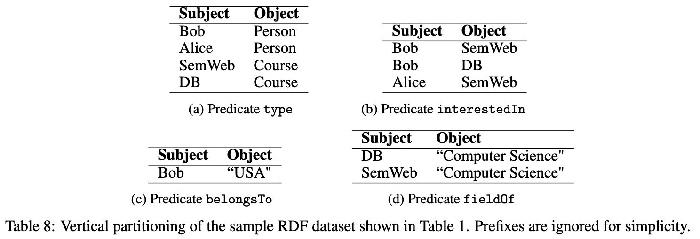

与 VP 相比，VT 不受多值谓词和与空值对应的缺失信息的影响。该方法对于使用绑定谓词（例如 ?s p ?o）回答 SPARQL 三元组模式特别有用。这是因为谓词表可以看作是谓词上的索引，因此在回答带有绑定谓词的三元组模式时只需要考虑单个表。然而，这种类型的存储并没有针对包含无界谓词（例如，s ?p ?o）的三重模式进行优化。这是因为谓词在三元组模式中显示为变量，三元组模式匹配将考虑一个。

### 马老师综述中的存储模式

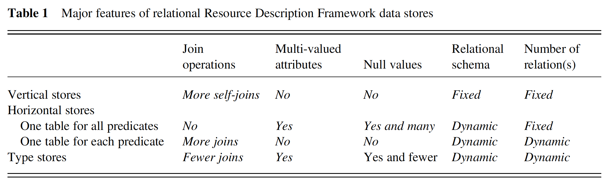

#### 1. 垂直存储

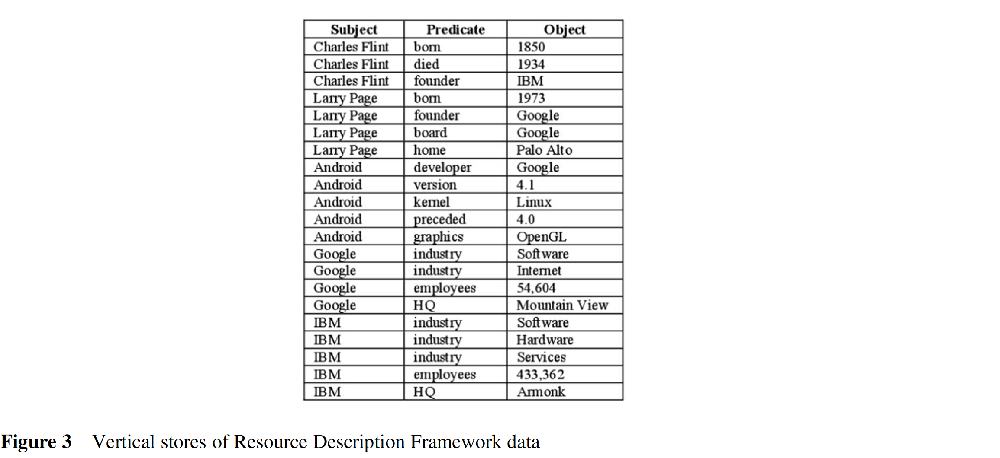

#### 2. 水平存储

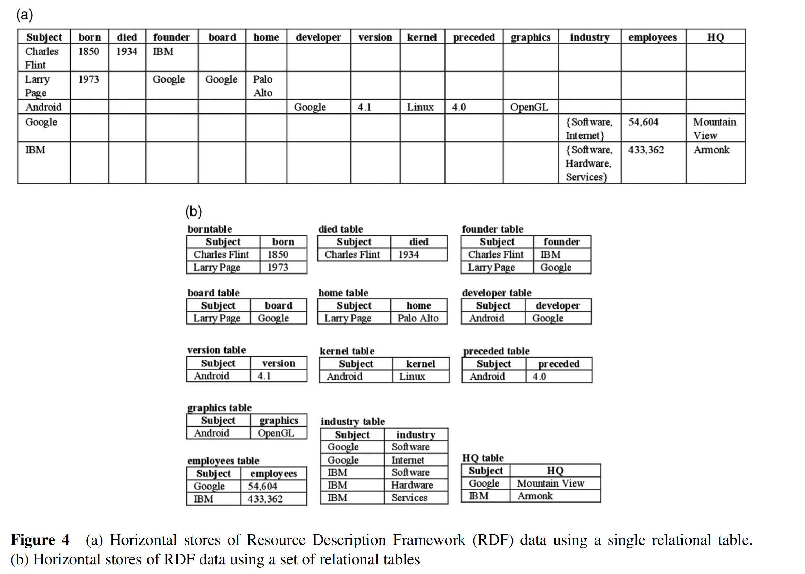

#### 3. 类型存储

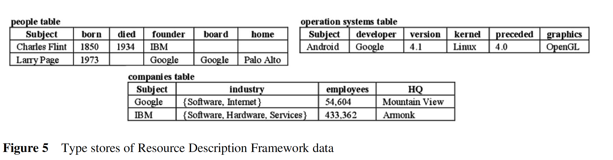

#### 分布式数据库模型

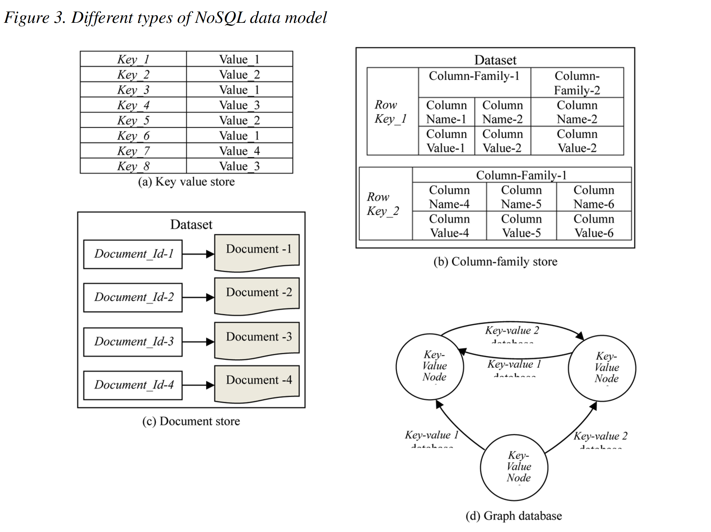

## DiStRDF模型

### 一、表示形式?

未具体说明，推测形式如下：

(Subject,Predicate,Object)[T1]

### 二、具体化

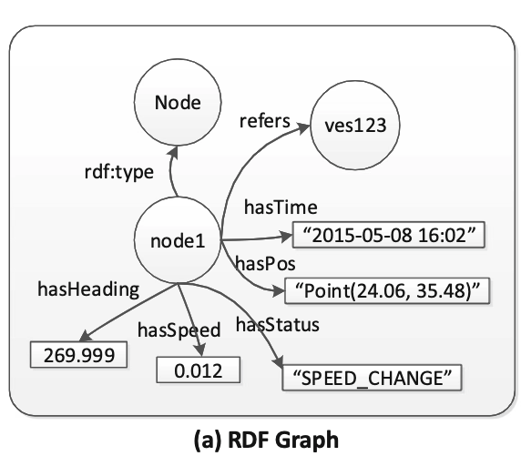

引入具体化谓词：

- 时间：hasTime
- 空间：hasPos

### 三、DiStRDF框架

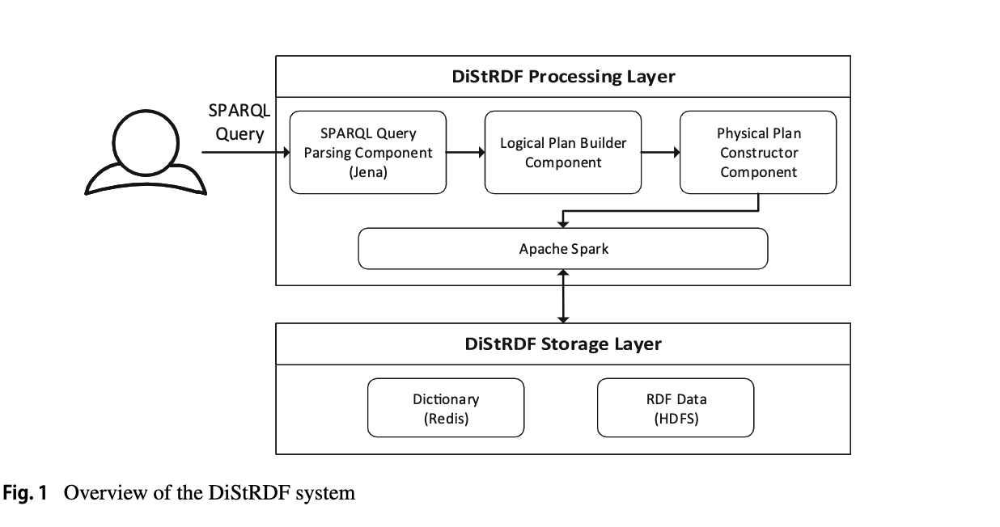

下面我们简要介绍一下这些层的主要组成部分层，通过 SPARQL 查询处理工作流。SPARQL 查询和单独的时空约束由用户提供给 DiStRDF 处理层。 SPARQL 查询解析组件检查查询语法的正确性并将其转换为机器可读的表示。逻辑计划构建器组件创建查询的逻辑计划表示，它结合了具有时空约束的 SPARQL 查询，并由一组逻辑运算符组成。然后，物理计划构造器组件通过为每个逻辑运算符选择实现算法，将逻辑计划转换为物理表示。处理层利用 Apache Spark 在一组计算机上并行执行查询。 DiStRDF 处理层的组件在第 5 节中有更详细的描述。请注意，我们目前没有使用特定于空间或时空数据的 SPARQL 扩展。但是，我们的系统旨在轻松支持此类扩展；人们可以轻松扩展用于查询表示的语言，然后将其转换为逻辑查询计划，并且底层的 DiStRDF 引擎及其组件仍将在此查询计划上运行。此更改将主要影响 SPARQL 查询解析组件，因为它负责将输入查询转换为机器可读的表示形式。

Spark从HDFS读取三倍于RDF的数据。通过利用一维时空编码方案，三元组以适合高效检索的格式存储。由于RDFdata是用这种技术编码的，所以主存分布式系统（Redis）被用作字典，将相应的存储值映射到它们的一维表示和原始值之间。DistridF存储层的组件在第4节中有更详细的描述。

#### 1. DiStRDF Processing Layer

DiStRDF 处理层是一个 SPARQL 查询引擎，支持对海量、时空 RDF 数据进行可扩展和高效的批量查询处理。为了实现 DiStRDF 处理层，需要一个并行的内存数据处理引擎。为此，我们选择了 Apache Spark [34]，这是一种流行的数据处理引擎，拥有最广泛的贡献者在主内存中实现 MapReduce 模型，从而为竞争对手系统（例如 Hadoop）实现了显着的性能提升 [27]。DiStRDF 处理层包括由三个组件组成，即 (a) SPARQL 查询解析组件、(b) 逻辑计划构建器组件和 (c) 物理计划构造器组件。在本节中，我们将描述这些组件的设计和实现。

##### a. SPARQL query parsing component

- 检查语法的正确性并确保正确指定查询，
- 将查询转换为处理引擎的其余模块将使用的内部表示。

假设语法正确，将 SPARQL 查询转换为一组基本图模式（BGP）。这些基本的图形模式被提供给逻辑规划器以构建逻辑查询计划。

##### b_1. Logical plan builder component

给定已成功通过查询解析步骤的 SPARQL 查询，逻辑计划构建器被分配了构建逻辑查询计划的任务，该计划由逻辑运算符的层次结构组成。本质上，逻辑查询计划代表了一种通过确定一组逻辑运算符的层次顺序来执行相应SPARQL 查询的方式。我们使用五种类型的逻辑运算符，如下所述。需要这些运算符来处理 SPARQL 查询的 BGP 部分。显然，这些操作符并未涵盖完整的 SPARQL 规范（例如，分组、排序等），但它们涵盖了范围广泛的 SPARQL 查询，并且构成了分布式 RDF 处理引擎的基本且具有挑战性的部分。

##### b_2. Spatio-temporal logical query plans

考虑由非时空 SPARQL 查询 Q 和时空范围约束 q 定义的查询的情况。抽象地说，这种查询的评估过程由两部分组成：（a）处理三元组模式以找到符合条件的三元组，以及（b）处理时空查询以在时空项中找到匹配的元组。最终结果是这些中间结果的交集。

##### c. Physical plan constructor component

逻辑查询计划构建完成后，物理计划构造器通过为每个逻辑节点分配一个物理操作符（即相应任务的具体实现），将其转化为物理执行计划。因此，在本节中，我们将介绍在 DiStRDF 查询引擎中实现的物理运算符。这些物理运算符旨在利用 Spark SQL API 的特性，在可用的计算节点之间分配工作负载。因此，我们的实现对数据集进行操作，这些数据集在主内存中建模为表，通常由 Spark SQL 数据帧表示。 DataFrames 是表示一组分布式元组的数据结构，能够并行处理包含的数据。

#### 2. DiStRDF Storage Layer

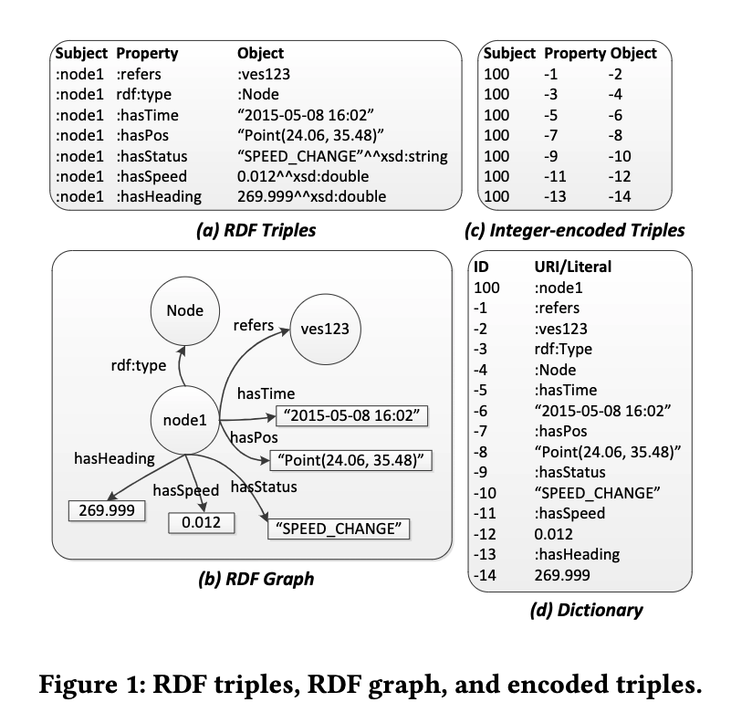

索引：One-dimensional (1D) encoding scheme

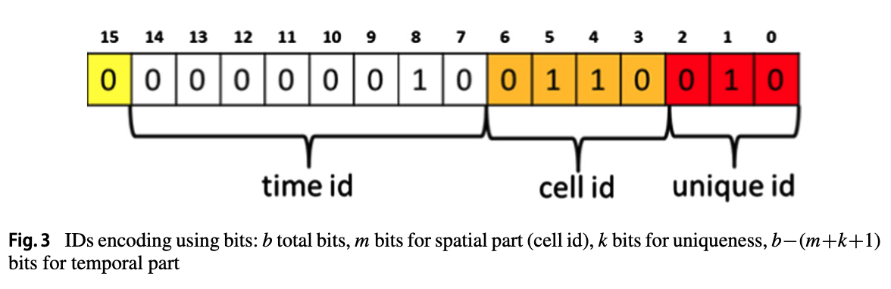

#### a. Storing the dictionary

将上述所有要求放在一起后，我们将注意力转向满足这些要求的分布式 NoSQL 键值存储。特别是，我们选择了 REDIS，5 一个开源的、内存中的、分布式的键值存储，它符合我们的目的。

- 存储在HDFS——文件布局，我们使用 Parquet，6 它提供了一种列格式，可以实现更好的压缩，并且对于仅检索几列表的查询性能更好。
- 字典，编码存储在Redis中（键值对）

##### b. Storage of RDF triples

- PT表
- TT表

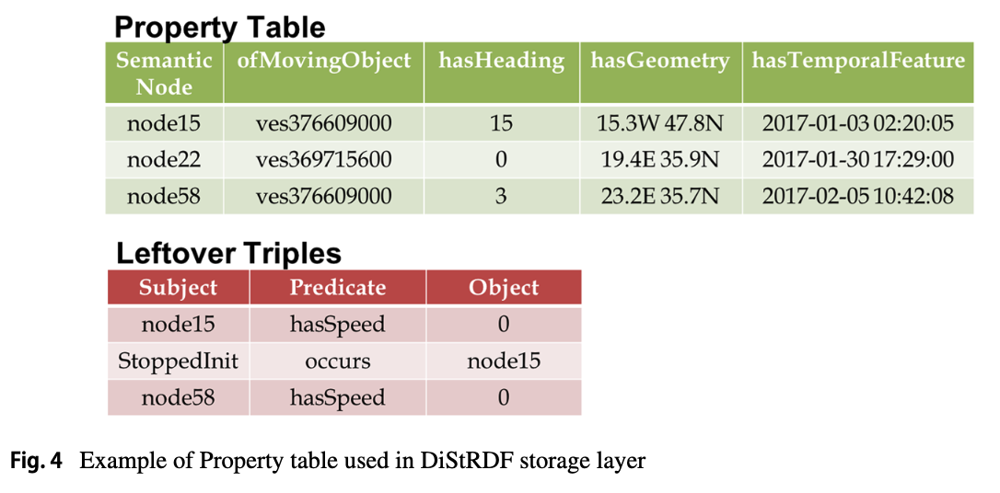

