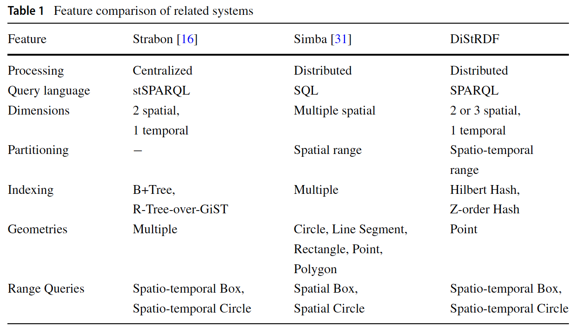
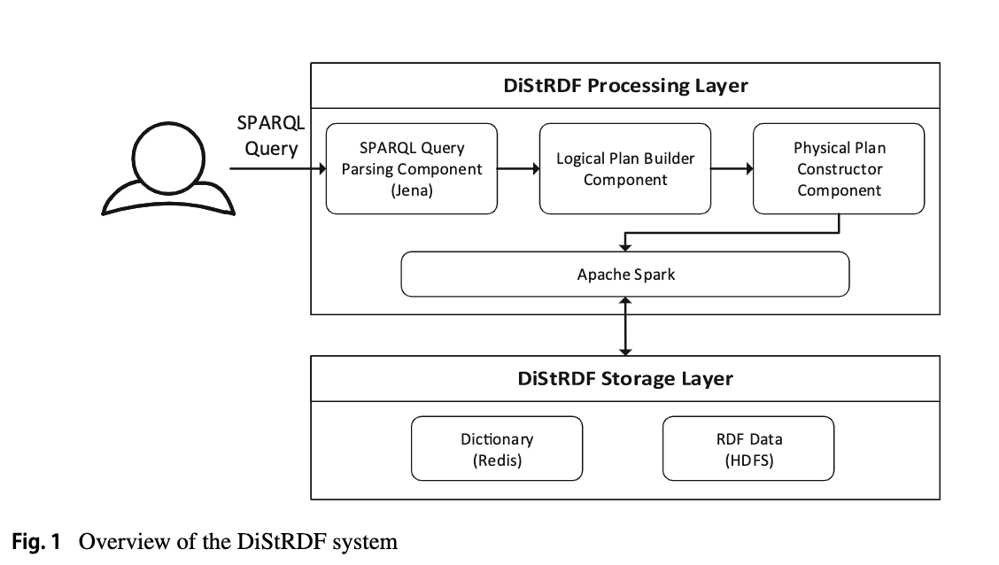
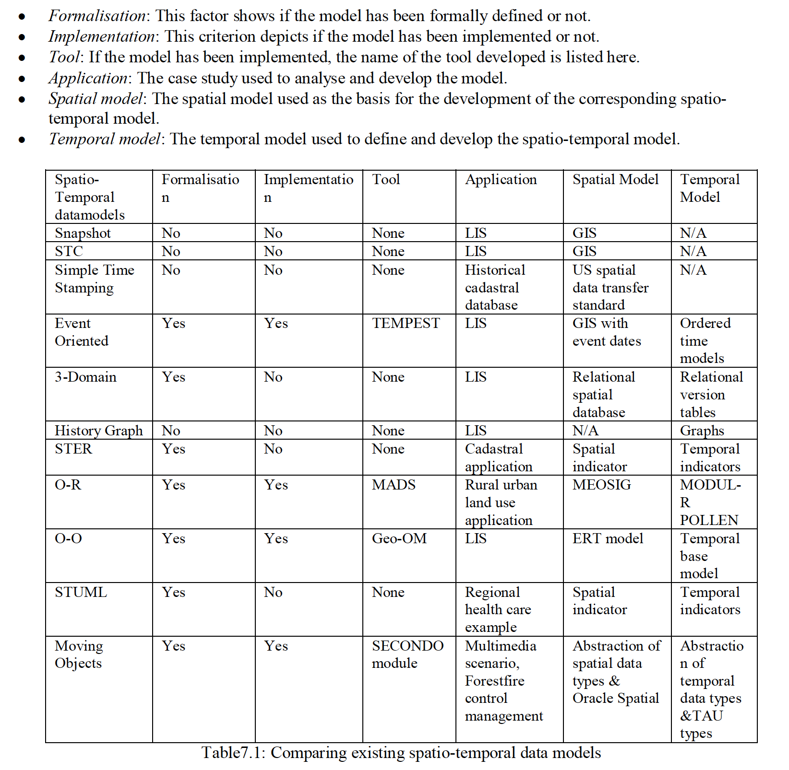

# 时空RDF存储相关系统

## 一、DiStRDF

### 1. 存储层

#### 1.1 一维（1D）编码方案

为了对移动实体的时空信息进行编码，我们首先将其空间位置映射为整数值。空间位置可以是2D（用于汽车，船只等）或3D（用于飞机），但是为简单起见，在下面的描述中我们将重点放在2D情况下。使用将空间分成$$2^m$$ = ($$2^{m/2}$$ *$$2^{m/2}$$)个等大小的单元格的网格划分空间位置，以及为网格的空间单元格提供排序的空间填充曲线。图2显示了2D情况form = 4的示例，其中描述了希尔伯特曲线和Z阶曲线，以及分配给每个单元格的ID。空间填充曲线旨在通过使附近的单元格也靠近曲线来保留空间局部性。明显地，从2D到1D时不可避免地会丢失一些信息，但是大多数情况下都保留了空间局部性。我们已经在系统中实现了两条曲线，但是对于更高的尺寸（例如3D），Z阶更易于扩展。

其空间位置被包围在一个空间像元中的任何实体都应分配一个唯一的标识符。因此，我们保留了用于为同一空间像元中的不同实体分配唯一ID的位。这样，适合于空间像元的实体的最大数量为$$2^k$$。

