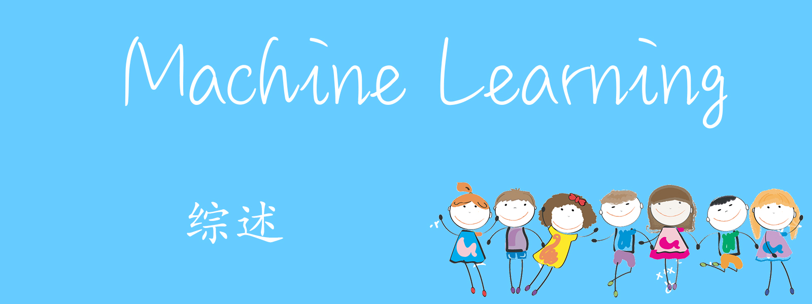

<!-- more -->

## 一、 前言 

### 1.1 机器学习（Machine Learning，ML ）
- 从人工智能（AI）衍生出的新领域
- 为计算机开发一项新的功能

### 1.2 机器学习的应用方向
- 数据挖掘
   网络与自动化的发展带来的庞大的数据集，在海量的信息中整理我们需要的信息。
   例如：网络流量分析、医疗记录、计算生物学、工程学领域
- 无法编写程序的领域
   例如：直升机自动驾驶、手写信息识别、自然语言处理（NLP）及计算机视觉（CV）
- 私人订制程序（个性化推荐）
   例如：亚马逊（国内的京东、淘宝）、奈非（Netflix，国内的B站、腾讯）的个性化推荐
- 理解人类的学习过程和大脑的工作方式

## 二、什么是机器学习
机器学习一直以来都没有一个统一的定义，即使在机器学习的研究圈子中也是如此。接下来将为大家介绍目前几个已经提出的关于机器学习的定义。

### 2.1 机器学习的定义
Arthur Samuel的定义：

`在没有明确设置的情况下使得计算机具有学习能力的研究领域。`

Tom Mitchell的定义：

`计算机程序从经验E中学习，解决某一任务T，进行某一性能度量P。通过测定P在任务T上的表现比经验E而提高。`

### 2.2 机器学习的算法
其中最主要的算法（也是本系列主要讨论的算法）：
- 监督学习
- 无监督学习

其他还有`强化学习`和`推荐系统`等机会介绍。

## 三、监督学习

### 3.1 监督学习的定义
监督学习就是在我们的数据集中存在正确的答案，我们将“情况”和它的“结果”都交给计算机，让计算机知道某种情况对应的结果是什么，并总结规律。当我们给出一个全新的情况时它便能得到该种情况下的结果是什么。

### 3.2 监督学习的分类
监督学习问题分为`回归问题`和`分类问题`。

#### 3.2.1 回归问题
在回归问题中，我们试图预测连续输出中的结果，这意味着我们试图将输入变量映射到某个连续函数。换句话说，我们要得到的结果是连续性的数值。例如给定一个人的照片，我们必须根据给定的照片来预测他们的年龄。年龄就是一个连续型的数值。

回归问题通常是用来预测一个值，如预测房价、未来的天气情况等等，例如一个产品的实际价格为500元，通过回归分析预测值为499元，我们认为这是一个比较好的回归分析。一个比较常见的回归算法是线性回归算法（LR）。另外，回归分析用在神经网络上，其最上层是不需要加上softmax函数的，而是直接对前一层累加即可。回归是对真实值的一种逼近预测。

#### 3.2.3 分类问题
在分类问题中，我们改为尝试预测离散输出中的结果。换句话说，我们正在尝试将输入变量映射为离散类别。换句话说，我们要得到的结果是离散性的数值例如对于患有肿瘤的患者，我们必须预测肿瘤是恶性还是良性的。肿瘤的情况只有良性和恶性两种，所以是离散性的数值。对于这种预测结果是两种的分类问题，我们称为二分类问题。

当然，也可能存在分类后结果存在多类的可能，比如我们要预测恶性肿瘤的时期（早期、中期、晚期），这种问题我们被称为多分类问题。

分类问题是用于将事物打上一个标签，通常结果为离散值。例如判断一幅图片上的动物是一只猫还是一只狗，分类通常是建立在回归之上，分类的最后一层通常要使用softmax函数进行判断其所属类别。分类并没有逼近的概念，最终正确结果只有一个，错误的就是错误的，不会有相近的概念。最常见的分类方法是逻辑回归，或者叫逻辑分类。

## 四、无监督学习

### 4.1 无监督学习的定义
无监督学习不知道预测主体，它是在一堆堆数据中不断挖掘并寻找数据之间的关系，而不是通过选取自变量预测因变量。简单来说，无监督学习就是找寻数据之间的联系或者说相同的结构。在无监督学习的情况下，没有基于预测结果的反馈。

### 4.2 无监督学习的分类
无监督学习主要可以解决`聚类问题`，还有类似`鸡尾酒会算法`的非集群问题。

#### 4.2.1 聚类问题
聚类就是将数据集中的样本划分为若干个通常是不相交的子集。在给定的数据集中，程序会不断分析他们的结构，从中找到相同的部分，并把它们分到同一组中，从而将整个数据集进行分组达到具有相似结构的数据聚类的效果。

例如收集1,000,000个不同基因的集合，然后找到一种方法，将这些基因自动分组为通过不同变量（例如寿命，位置，角色等）在某种程度上相似或相关的组。

#### 4.2.2 “鸡尾酒会算法”，
鸡尾酒会算法使的程序可以在混乱的环境中找到结构。（即在鸡尾酒会上从一连串的声音中识别出个人的声音和音乐）。 

## 五、结尾
在接下来的文章中，笔者会和大家进一步讨论传统机器学习中一些重要的模型。
