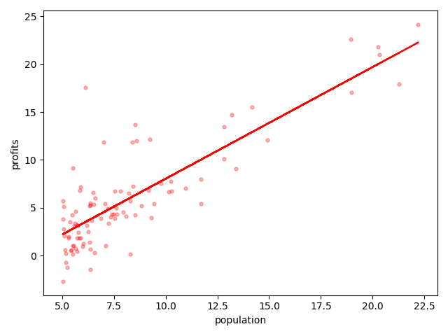

## 一、前言

本篇文章主要讲述单变量线性回归这一算法。首先我们来分析一下这个短语，`回归`表示这个算法适用于监督学习中的回归问题，是对连续性变量的预测。`线性`则表示我们的假设函数（hypothesis）是一个一次函数（无论有多少因变量，因变量都是一次的）。`单变量`则表示我们的因变量只有一个，我们通过因变量去预测对应的函数值（结果）。所以单变量线性回归可以解决一个因素线性的映射到一个连续的假设结果上的问题。

现在你的朋友要卖房子。我们要预测某个大小的房子可以买多少钱，这里首先我们可以确定这是一个回归问题，又因为我们只考虑房子大小对房子价钱的影响，那么影响房价的因素只有一个——“房子的面积”，所以这个问题我们便可以利用单变量线性回归的算法来处理这个问题。

但是如果建立一个坐标系，将房面积作为横坐标，将房价作为纵坐标。那么单变量线性回归则是要找出一条直线来拟合所有数据。但是经过观察，其实如果利用非线性函数（比如`log函数`）来拟合效果更好，这其实就是机器学习中一个很重要的问题——假设函数的选择。这个问题涉及的方面有很多，我们不做讨论。我目前想到的解决方法就是先用线性函数去拟合，如果发现正确率不高，则可考虑采用非线性的函数拟合。至于采用什么函数，那是以后要解决的问题。

## 二、模型和代价函数

### 2.1 模型表示
为了建立供将来使用的符号，定义以下概念：
- $x^{i}$表示“输入”变量,也称为输入要素。
-  $y^{i}$表示我们试图预测的“输出”或目标变量。
- $\left\{ x^{i},y^{i} \right\}$被称为一个训练实例。
- 我们使用的训练集就是一个训练实例的集合，即$\left\{ x^{i},y^{i} \right\}\,i=1,2...m$。
- m表示训练集中训练实例的个数。

注意，符号中的上标“$i$”只是训练集中的一个索引，与幂运算无关。

为了更正式地描述单变量线性回归问题，我们的目标是：给定一个训练集，让计算机学习一个函数：$h_{\theta }(x)=\theta_{0} + \theta_{1}x$，使得$h_{\theta }(x)$是对应于Y值的“好”预测函数。这个函数h被称为`假设函数（hypothesis function）`。

### 2.2 代价函数
代价函数（cost function）或损失函数（loss function）是将随机事件或其有关随机变量的取值映射为非负实数以表示该随机事件的“风险”或“损失”的函数。在应用中，代价函数通常作为学习准则与优化问题相联系，即通过最小化代价函数求解和评估模型。

在最优化，统计学，计量经济学，决策论，机器学习和计算神经科学的领域中，**损失函数**或**代价函数**是指一种将一个事件（在一个样本空间中的一个元素）映射到一个表达与其事件相关的经济成本或机会成本的实数上的一种函数，借此直观表示的一些"成本"与事件的关联。一个最佳化问题的目标是将损失函数最小化。一个**目标函数**通常为一个损失函数的本身或者为其负值。当一个目标函数为损失函数的负值时，目标函数的值寻求最大化。

上述定义分别来自于百度百科和维基百科，可能读起来不那么容易理解，但是确实代价函数的抽象定义。

在具体的问题中，我们需要将抽象的问题具体到我们要解决的问题中，那么在我们单变量线性回归问题中的代价函数究竟是怎样的呢？接下来我们将讨论在单变量线性回归中的代价函数。

#### 2.2.1 代价函数的通俗理解

首先我们要明确，在单变量线性回归这一算法中我们要求解的是什么？当然是根据$x$取得$y$的值。表达式为 $h_{\theta }(x)=\theta_{0}+\theta_{1}x$。我们将$x$代入即可获得$y$的值。那我们需要数据集做什么？训练模型。为什么要训练模型？因为我们不知道$\theta_{0}$与$\theta_{1}$。

好，问题就此分开，我们的代价函数，是在训练模型阶段使用的函数，他和最后结果没有关系，他是为了帮我们确定$\theta_{0}$与$\theta_{1}$进而确定整个$h_{\theta }(x)$具体表达式。所以他是一个关于$\theta_{0}$与$\theta_{1}$的函数。其实训练阶段，不就是我们已知$x$与$y$，然后得到 $\theta_{0}$与 $\theta_{1}$的过程么？然后确定了$\theta_{0}$与$\theta_{1}$后，我们已知$\theta_{0}$与$\theta_{1}$，通过新的$x$得到新的$y$。

#### 2.2.2 单变量线性回归中代价函数的定义
代价函数是一个关于$\theta_{0}$与$\theta_{1}$的函数，通常记为$J(\theta_{0},\theta_{1})$。

通过代价函数的概念我们知道，在实际过程中我们是通过最小化代价函数来求解模型。因为在函数中存在两个参数：$\theta_{0}$与$\theta_{1}$。在一个方程中存在两个变量，我们求解时只能采用试值的方式来求解。就是我们不断假定$\theta_{0}$与$\theta_{1}$的值，然后计算代价函数的值。最后选取使代价函数最小值的那一组$\theta_{0}$与$\theta_{1}$作为标志带入$h_{\theta }(x)$中。

#### 2.2.3平方差代价函数

平方差代价函数是代价函数的一种，针对于回归问题、特别是线性回归问题，平方差代价函数是一个十分优秀的代价函数。他的具体定义如下：

$$
J(\theta_{0},\theta_{1})=\frac{1}{2m}\sum_{i=1}^m (h_{ \theta}(x^{(i)})-y^{(i)})^{2}
$$

将$h_{\theta }(x)$带入则可得到如下函数：

$$
J(\theta_{0},\theta_{1}) = \frac{1}{2m}\sum_{i=1}^m （\theta_{0} + \theta_{1}x^{(i)} - y^{(i)}）^{2}
$$

根据上式，我们先假设一组$\theta_{0}$与$\theta_{1}$，将训练集中的每一组$\left\{ x^{i},y^{i} \right\}$带入。即可得到在该组$\theta_{0}$与$\theta_{1}$下我们的$J(\theta_{0},\theta_{1})$的取值。通过不断假设$\theta_{0}$与$\theta_{1}$。我们可以选择到那组$\theta_{0}$与$\theta_{1}$使得$J(\theta_{0},\theta_{1})$的值最小，那么他就是我们最终需要的结果。记为$\min_{\theta_{0},\theta_{1}}J(\theta_{0},\theta_{1})$

代价函数其实就是计算在特定的$\theta_{0}$与$\theta_{1}$下我们得到的结果与实际的结果之间的损失值。平方差代价函数就是将每一组训练例得到的结果与实际结果之间做平方差运算，得到该组测试例的误差。再将所有测试例的误差做一个平均值。得到的结果就是在该组$\theta_{0}$与$\theta_{1}$我们的误差值。这个值越小，我们的$\theta_{0}$与$\theta_{1}$就越合理。

在上述定义中，有些读者可能会存在疑问，既然求平均值，那为什么是$\frac{1}{2m}$而不是$\frac{1}{m}$呢？

- 首先，因为对于很多组数据求平均值，和对很多组数据求平均值的一半。最后得到的结果之间的大小关系是不变的。也就是说对于不同$\theta_{0}$与$\theta_{1}$的组合，我们最后用$\frac{1}{2m}$去求平均值和利用$\frac{1}{m}$求平均值，我们依旧能选择出使误差最小的$\theta_{0}$与$\theta_{1}$的组合。
- 但是考虑到是求平方差，所以在对$J(\theta_{0},\theta_{1})$求导时必定有一个2，而我们的$\frac{1}{2m}$中的2正好会消除这个多余的常数而不对整体结果产生影响。所以这个$\frac{1}{2m}$的作用是`在不影响结果的前提下消除求导数时常数带来的影响`。那我们为什么要求导呢？请接着往下看。

因为线性函数的特性，所以这种平方差的误差计算比较合理。所以平方差代价函数在线性回归中十分常用且具有不错的效果，我们在之后也会讨论其他代价函数。

下面的图实在单变量线性回归问题中的代价函数$J(\theta_{0},\theta_{1})$的图像，根据图像可知，我们需要的$\theta_{0}$与$\theta_{1}$就是图像中最低点所对应的$\theta_{0}$与$\theta_{1}$的值。


## 三、参数学习

### 3.1 梯度下降算法
梯度下降算法是一种比较简单的`数学优化（ Mathematical optimization）`算法，了解过优化的读者可能比较熟悉。针对于优化问题有着详细的研究分支，在这里对于此就不详细展开。优化问题可以简单理解为求取最优解，我们现在要面临的问题就是要求取$J(\theta_{0},\theta_{1})$的最小值，所以在这里我们使用梯度下降这一算法来计算$\theta_{0}$与$\theta_{1}$。

#### 3.1.1 梯度下降算法的定义
梯度梯度算法拥有其广义上的定义，在本节我们先不展开，等到多变量线性回归是我们再展开讲解。
在单变量线性回归中，梯度算下降的定义如下：
$$
\theta_j := \theta_j - \alpha \frac{\partial}{\partial \theta_j} J(\theta_0, \theta_1) \qquad j=0,1
$$
**注意，在每次迭代时，应同时更新参数 $\theta_{0}$，$\theta_{1}$ 。**

#### 3.1.2 定义中参数的具体含义

符号                                                       | 含义                                         
------------------------------------------------------------ | -------------------------------------------------- 
:=                                                           | 赋值符号，将表达式右边的值赋给表达式左边。       
$\alpha$                                                     | 学习速率，我们梯度下降的快慢。               
$\frac{\partial}{\partial \theta_j} J(\theta_0, \theta_1)$ | 当前参数在该点处切线的斜率（梯度的一部分）。

$\alpha$的术语叫做学习速率，主要决定我们每次梯度下降的速度。这个速度是我们调参中一个重要的参数。

由下图所知：
- 当$\alpha$过小时，到达最优解的步数多，时间长。当数据集大时特别明显。
- 当$\alpha$过大时，有可能跳过最优解，从而导致无法收敛（无法到达最优解）。


了解高等数学和线性代数的读者可能会比较熟悉这个向量：$[\frac{\partial}{\partial \theta_0} J,\frac{\partial}{\partial \theta_1} J]^\top$。在单变量线性回归的梯度下降算法的定义中，这个向量被称为`梯度向量`。这也就是为什么我们称这个算法为梯度下降算法，因为在每次迭代$\theta_{0}$与$\theta_{1}$我们利用的都是它的梯度（沿当前点下降的最快方向）。

#### 3.1.3 梯度下降在线性回归问题中的实用性
在图像中，我们的梯度下降算法类似于下面这张图片。因为我们每次下降的方向都是当前下降幅度最大的方向，所以我们会沿着一个下坡的路径直到最低谷，也就是局部最小值。此点的切线斜率为0，此时$\theta_{0}$，$\theta_{1}$收敛。


既然是局部最小值，那就并不是唯一最小值。从而会引发出以下两个问题：
1. 选择不同的起始值可能会到达不同的局部最小值。
2. 当前的局部最小值其实很“大”，只不过他的周围比较“高”。

第一个问题可以用下面这张图来表示。这张图和上面一张图是同一个代价函数，但是我们选择了另一个点作为起始值。我们可以发现它们最后到达的局部最小值是不同的。


第二问题其实比较好理解，想象一下我们下山。但是正好在山腰有一个坑，我们掉进了坑里。我们观察周围（计算斜率），确定这就是局部最小值。我们觉得自己已经下山了。这会引起很大的错误，因为其实我们才下到一半的位置。但是从其他出发点下山的人没有遇到这个坑，他们会下到山底。两种情况下的正确率会相去甚远。

所以以上的两个问题都回归到一点，就是我们初始值的选择似乎格外的重要。但是我们在梯度下降算法中的初始值是随机选择的，这似乎就变成了一个很麻烦的事情。

但是经过我们的实践，大多是线性回归问题中的代价函数都是“凸函数”，就比如我们上面提到的平方差代价函数的图像。在这里我们不去严格定义什么是凸函数，我们大概感知可能是向外突出的函数。实际上凸函数的定义很严格，但他们大多数个局部最小值，类似$y=x ^{2}$的图像。

基于此，在线性回归问题中，我们无论选择什么初始值，理论上都会到达“唯一”的局部最小值。这也是为什么梯度下降算法很适合线性回归问题的代价函数的求解。

#### 3.1.4 梯度下降算法的计算
了解了梯度下降算法的定义后，我们再来了解一下梯度下降算法的计算方法。

针对于梯度下降算法的定义，我们将对应部分计算出结果后得到如下计算公式：
$$
\begin{align*} \text{repeat until convergence: } \lbrace & \newline \theta_0 := & \theta_0 - \alpha \frac{1}{m} \sum\limits_{i=1}^{m}(h_\theta(x^{i}) - y^{i}) \newline \theta_1 := & \theta_1 - \alpha \frac{1}{m} \sum\limits_{i=1}^{m}\left((h_\theta(x^{i}) - y^{i}) x^{i}\right) \newline \rbrace& \end{align*}
$$

根据上述我们可知，这是一个迭代的过程，我们只需要每次迭代$\theta_{0}$，$\theta_{1}$，直到它们收敛就可以了。这就是迭代法的计算过程。

但是存在一个问题：着我们越来越接近收敛，$\theta_{0}$与$\theta_{1}$迭代速度会越来越慢。假设斜率从10下降到0.1只需要3次迭代，那么从斜率从0.1到0.001可能需要10次迭代。随着斜率不断接近于0，这个速度会越来越慢。但其实当斜率变为0.001时的$\theta_{0}$，$\theta_{1}$和当斜率变为0时的$\theta_{0}$，$\theta_{1}$差距已经很小了，我们可以认为他已经收敛了。所以我们应该设置一个收敛误差，当我们两次迭代之差小于收敛误差时我们便认为已经收敛。

但在实际的应用过程中，我们往往采用另一种方法。那就是直接设置收敛次数，然后根据图像（代价函数的值-迭代次数）来判断是否符合要求。例如：我们设置迭代次数为1500次，发现代价函数的值依旧没有平滑，而是有明显的继续下降的趋势，那就说明我们的迭代次数不够，需要继续迭代。如果发现代价函数的值接近平滑，就说明基本已经收敛。

在梯度下降的公式中，存在一个求和符号。这个求和符号的含义就是我们要计算每一组训练实例对参数的影响（平方差代价函数）。针对于这个求和符号，我们有以下两种计算方法。
- 迭代法
- 矩阵法

##### 迭代法：
我们直接利用for循环将每组训练实例带入并计算出结果，从而得到求和的结果，进而更新$\theta$参数。

我们迭代上述过程，直到$\theta$参数收敛。

##### 矩阵法：
此部分涉及线性代数的知识，大家可以有选择的观看。
我们将上述迭代公式做一下改变：
$$
\begin{aligned} \text{repeat until convergence: } \lbrace & \newline \theta_0 := & \theta_0 - \alpha \frac{1}{m} \sum\limits_{i=1}^{m}\left((h_\theta(x^{i}) - y^{i})*1\right) \newline \theta_1 := & \theta_1 - \alpha \frac{1}{m} \sum\limits_{i=1}^{m}\left((h_\theta(x^{i}) - y^{i})*x^{i}\right) \newline \rbrace& \end{aligned}
$$

此时对线性代数敏感的读者应该有点感觉了，接下来我们对训练集来进行一下改动。

针对于训练集，我们将其拆分为两部分：

- 将训练集中的所有$y^{i}$构成一个$m\times 1$的矩阵（向量）
$$
\vec{y}=[y^{1},y^{2},...\quad,y^{m}]^\top
$$
- 将训练集中的所有$x^{i}$构成一个$m\times 2$的矩阵（矩阵的第一列用1填充，第二列为$x^{i}$的集合）：
$$
X=\begin{bmatrix}
1 & x^{1}\\ 
 1&x^{2} \\ 
 ...& ...\\ 
 1& x^{m}
\end{bmatrix}
$$
- 将所有参数$\theta$构成一个$2\times 1$的矩阵：
$$
\vec{\theta}=[\theta_0,\theta_1]^\top
$$

将特征构建成一个特征向量：
$$
\vec{x}=[1,x_1]^\top
$$
则假设函数可以写作如下形式：
$$
h_{\theta }(x)=\vec{\theta}^{\top}\vec{x}
$$
则所有由$h_{\theta }(x)$函数计算出的预测结果构成的向量为：
$$
\vec{y`}=X\vec{\theta}
$$
代价函数可以利用下面的公式计算，其中$\sum$符号的含义是计算矩阵中（其实是一个$m\times 1$的向量）所有元素的和。
$$
J(\theta_{0},\theta_{1})=\frac{1}{2m}\sum(\vec{y`} - \vec{y})^{2}\\
J(\theta_{0},\theta_{1})=\frac{1}{2m}\sum(X\vec{\theta} - \vec{y})^{2}\\
J(\theta_{0},\theta_{1})=\frac{1}{2m}(X\vec{\theta} - \vec{y})^\top(X\vec{\theta} - \vec{y})
$$
那么梯度下降的公式即可化为：
$$
\vec{\theta}=\vec{\theta}-\alpha \frac{1}{m}((X\vec{\theta} - \vec{y})^\top X)^\top
$$
将转置带入并展开可以得到：
$$
\vec{\theta}=\vec{\theta}-\alpha \frac{1}{m}*(X^\top(X\vec{\theta} - \vec{y}))
$$

最后会得到一个$2\times 1$的$\vec{\theta}$向量，其中第一行第一列为更新过后$\theta_0$，第二行第一列是更新过后$\theta_1$

我们迭代上述过程，直到$\theta$参数收敛。

#### 3.1.5  批量梯度下降算法
梯度下降算法有许多的分类，我们上面介绍的梯度算法被称为`批量梯度下降算法（Batch Gradient Descent, BGD）`。因为在每次梯度下降时，我们都会使用到所有的训练集去更新$\theta_{0}$和$\theta_{1}$，所以我们称其为批量梯度下降算法。
除此之外，还有`随机梯度下降法（Stochastic Gradient Descent, SGD）`和`小批量梯度下降法（Mini-Batch Gradient Descent, MBGD）`。在此就不过多介绍

## 四、单变量线性回归实例

### 4.1 实例问题
假设你是一家餐馆特许经营的首席执行官，并正在考虑在不同的城市开设新的出路。 这个连锁店在各个城市已经有卡车，而且你有来自城市的利润和人口数据。您想使用这些数据来帮助您选择要扩展到下一个城市。

### 4.2 代码实现
迭代法实现的方式比较简单，这里直接采用矩阵法来编写代码。想使用迭代法的同学可以自己尝试，最终结果与下面相差不大即可接受。

ex1.py
```python
import matplotlib.pyplot as plt
import numpy as np
from matplotlib.colors import LogNorm
from mpl_toolkits.mplot3d import axes3d, Axes3D
from computeCost import *
from gradientDescent import *
from plotData import *
from matplotlib import cm

'''第1部分 可视化训练集'''
print('Plotting Data...')
data = np.loadtxt('ex1data1.txt', delimiter=',', usecols=(0, 1))  # 加载txt格式的数据集 每一行以","分隔
X = data[:, 0]  # 输入变量 第一列
y = data[:, 1]  # 输出变量 第二列
m = y.size  # 样本数

plt.ion()
plt.figure(0)
plot_data(X, y)  # 可视化数据集

input('Program paused. Press ENTER to continue')

'''第2部分 梯度下降法'''
print('Running Gradient Descent...')

X = np.c_[np.ones(m), X]  # 输入特征矩阵 前面增加一列1 方便矩阵运算
theta = np.zeros(2)  # 初始化两个参数为0

iterations = 1500  # 设置梯度下降迭代次数
alpha = 0.01  # 设置学习率

# 计算最开始的代价函数值  并与期望值比较 验证程序正确性
print('Initial cost : ' + str(compute_cost(X, y, theta)) + ' (This value should be about 32.07)')

# 使用梯度下降法求解线性回归 返回最优参数 以及每一步迭代后的代价函数值
theta, J_history = gradient_descent(X, y, theta, alpha, iterations)

print('Theta found by gradient descent: ' + str(theta.reshape(2)))

# 在数据集上绘制出拟合的直线
plt.figure(0)

line1, = plt.plot(X[:, 1], np.dot(X, theta),'r', label='Linear Regression')
plot_data(X[:, 1], y)  # 可视化数据集
plt.legend(handles=[line1])

input('Program paused. Press ENTER to continue')

# 用训练好的参数 预测人口为3.5*1000时 收益为多少  并与期望值比较 验证程序正确性
predict1 = np.dot(np.array([1, 3.5]), theta)
print('For population = 35,000, we predict a profit of {:0.3f} (This value should be about 4519.77)'.format(
    predict1 * 10000))
# 用训练好的参数 预测人口为7*1000时 收益为多少  并与期望值比较 验证程序正确性
predict2 = np.dot(np.array([1, 7]), theta)
print('For population = 70,000, we predict a profit of {:0.3f} (This value should be about 45342.45)'.format(
    predict2 * 10000))

input('Program paused. Press ENTER to continue')

'''第3部分 可视化代价函数'''
print('Visualizing J(theta0, theta1) ...')

theta0_vals = np.linspace(-10, 10, 100)
theta1_vals = np.linspace(-1, 4, 100)

xs, ys = np.meshgrid(theta0_vals, theta1_vals)
J_vals = np.zeros(xs.shape)

# Fill out J_vals
for i in range(0, theta0_vals.size):
    for j in range(0, theta1_vals.size):
        t = np.array([theta0_vals[i], theta1_vals[j]])
        J_vals[i][j] = compute_cost(X, y, t)

J_vals = np.transpose(J_vals)

plt.figure(1)
plt.plot(np.arange(iterations),J_history,'r')
plt.xlabel('Iterations')
plt.ylabel('Cost')
plt.title('Error vs. Training Epoch')
plt.show()

fig1 = plt.figure(2)
ax = fig1.gca(projection='3d')
ax.plot_surface(xs, ys, J_vals )
plt.xlabel(r'$\theta_0$')
plt.ylabel(r'$\theta_1$')
plt.show()

plt.figure(3)
lvls = np.logspace(-2, 3, 20)
plt.contour(xs, ys, J_vals, levels=lvls, norm=LogNorm())
plt.plot(theta[0], theta[1], c='r', marker="x")
plt.show()

input('ex1 Finished. Press ENTER to exit')
```

plotData.py

```python
import matplotlib.pyplot as plt


def plot_data(x, y):
    plt.scatter(x, y, marker='.', s=50, alpha=0.3,c='r')  # 绘制散点图
    plt.xlabel('population')  # 设置x轴标题
    plt.ylabel('profits')  # 设置y轴标题

    plt.show()
```

computeCost.py
```python
import numpy as np

def compute_cost(X, y, theta):
    m = y.size
    cost = 0
    cost = 1/(2*m)*np.sum(np.power(((X.dot(theta.T)) - y), 2));
    return cost
```

gradientDescent.py
```python
import numpy as np
from computeCost import *


def gradient_descent(X, y, theta, alpha, num_iters):
    m = y.size  # 样本数
    J_history = np.zeros(num_iters)  # 每一次迭代都有一个代价函数值

    for i in range(0, num_iters):  # num_iters次迭代优化
        theta = theta - (alpha / m) * (X.dot(theta.T) - y).T.dot(X)
        J_history[i] = compute_cost(X, y, theta)  # 用每一次迭代产生的参数 来计算代价函数值

    return theta, J_history

```
### 4.3 模型效果
模型拟合图如下，从图像中看拟合效果比较不错。


下面是代价函数的值与迭代次数的函数图。我们可以发现代价函数明显变小，并在迭代到一定次数后基本收敛。迭代次数选择也比较合理


下面是代价函数在不同的$\theta_{0}$与$\theta_{1}$时的取值，可以发现图像向下“突出”，是个凸函数。平方差代价函数的选择也很合理。

