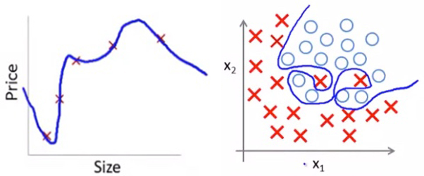

<!-- more -->

## 一、假设函数的拟合程度

在谈论正则化问题之前，我们先来讨论另一个问题，就是假设函数的拟合程度。所有机器学习算法的目的都是为了确定拟合函数，但是由于我们选择的拟合函数的形式不相同，拟合出的函数也不相同。我们将假设函数拟合数据的程度分为三种：

- 欠拟合（**高偏差(bias)**）
- 拟合
- 过度拟合（**高方差(variance)**）

当然，通过名称你就会发现，我们需要的是“拟合”这种情况。

欠拟合很容易理解，比如我们同线性回归去拟合逻辑回归问题，发现拟合的并不理想，这就是欠拟合。那么什么是过度拟合呢？

过度拟合，是指假设函数几乎完美的拟合了训练集。也就是说几乎所有的训练集中的训练实例都被完美的拟合在了假设函数中。如下图所示：

可以看到，在上图中，无论是回归问题（左1）还是分类问题（右1），假设函数和决策边界都很好的发挥了作用。那肯定有人会说，过度拟合效果很好啊，其实并不然。

在我们训练好模型以后、我们将假设函数投入实际应用时、也就是说我们面对新来的数据时，过度拟合是一个很可怕的问题。因为它会对新数据产生很大的排斥性。在上图（右1）的分类问题中，我们发现这个决策边界拟合的太完美了，很明显位于蓝色区域中的两个红色数据应该是误差项，我们生活中也存在并允许这种误差。但上述决策边界完美的避开了这两个位置，那么如果其中一个红色数据旁是一个蓝色数据，但它不在我们的训练集中。当我们利用这个数据去假设函数中求取结果时，那么变回出现错误的结果。所以过拟合在训练模型时效果很好，我们可能得到100%的正确率，但它一旦被应用于解决实际问题，当它面对新数据时，便会体现出强大的排斥性。可能正确了还不到50%。

在实际应用中，我们有两个主要选项可以解决过度拟合的问题：

1. 减少功能数量：
	手动选择要保留的特征。使用模型选择算法（在后面我们会了解到一些选择算法）。
2. 正则化：
	保留所有功能，但减少参数的大小。当我们具有许多稍微有用的特征时，正则化效果很好。

上述两种方法各有各的优点，我们可以根据具体需要来选择。

关于模型选择算法我们以后再说，这里来主要讨论一下`正则化（Regularization）`

## 二、正则化

如果我们过度拟合了功能假设，则可以通过增加其成本来降低功能中某些术语的权重。

你可能不太理解上面的描述为什么会降低拟合程度，不过没关系。我们这里给出通用的方法来进行正则化，那就是在代价函数后面加上正则项。

虽然我们不会深入了解正则化的由来，但我们还是想给你解释一下我们最开始的定义：

如果我们发生的过拟合的情况，主要原因就是参数太多，并且它们的影响都很大，所以我们试着在代价函数中增加这个参数的一个“惩罚项”，这样代价函数为了保持最小，就会减小对应$\theta$的值这样的画我们的过拟合问题就会得到缓解。

那么我们怎么确定要惩罚哪个参数呢？我们采用的策略是惩罚所有的与特征相关的$\theta$，也就是$\theta_1,\theta_2,...,\theta_n$,注意，其中不包括$\theta_0$。事实上，即使惩罚$\theta_0$，得到的结果也不会产生很大的误差。

所以，我们最新的代价函数:

$$
J'(\theta_1,\theta_2,...,\theta_n)=J(\theta_1,\theta_2,...,\theta_n)+ \lambda\sum_{i=1}^n (\theta_j)^2
$$
其中$\lambda$称为正则化参数,**λ 要做的就是控制在两个不同的目标中的平衡关系。**

我们来分析一下新的代价函数：

- $J(\theta_1,\theta_2,...,\theta_n)$部分保证我们的实际代价是最小值。
- $\lambda\sum_{i=1}^n (\theta_j)^2$部分保证我们$\theta_j$要尽可能小。

所以最新的代价函数，实在实际代价和参数之间做了一个平衡，让二者都尽可能小。这样既保证了我们代价函数本来的意义（优化代价函数），又使得我们参数$\theta_j$尽可能小。从而达到正则化的目的。

当然可能有些读者还存在疑问，为什么参数$\theta_j$尽可能小，就可以解决过拟合的问题呢？

**实际上，这些参数的值越小，通常对应于越光滑的函数，也就是更加简单的函数。因此 就不易发生过拟合的问题。**

具体需要大家自己去探寻，在这里就不过多展开了。

下面让我们看一下正则化在我们之前了解过的两种算法中的应用。

## 三、正则化在线性回归中的应用

根据上述描述，在线性回归问题中，我们的代价函数变为了如下形式：
$$
J(\theta_{0},\theta_{1},...,\theta_{n})=\frac{1}{2m}(\sum_{i=1}^m (h_{ \theta}(x^{(i)})-y^{(i)})^{2}+ \lambda\sum_{i=1}^n (\theta_j)^2）
$$

此时我们利用矩阵计算代价函数的公式如下：
$$
\begin{aligned}
& \vec{\theta'}=[0,\theta_1,\theta_2,...,\theta_n] \\
& J(\theta_{0},\theta_{1},...,\theta_{n})=\frac{1}{2m}((h_{\theta}(X\vec{\theta})-\vec{y})^{\top}(h_{\theta}(X\vec{\theta})-\vec{y})+ \lambda((\vec{\theta'}^{\top})\vec{\theta'}))
\end{aligned}
$$

由于在线性回归中存在两种优化代价函数的方式，我们一一来分析。

### 3.1 梯度下降

根据梯度下降的定义：
$$
\theta_j := \theta_j - \alpha \frac{\partial}{\partial \theta_j} J(\theta_0, \theta_1,... ,\theta_n) \qquad j=0,1,...n
$$

我们将对应部分求导，并代入公式（注意，$\theta_0$没有被惩罚）：
$$
\begin{align*} 
& \text{Repeat}\ \lbrace \\ 
& \ \ \ \ \theta_0 := \theta_0 - \alpha\ \frac{1}{m}\ \sum_{i=1}^m (h_\theta(x^{(i)}) - y^{(i)})x_0^{(i)} \\
& \ \ \ \ \theta_j := \theta_j - \alpha\ \left[ \left( \frac{1}{m}\ \sum_{i=1}^m (h_\theta(x^{(i)}) - y^{(i)})x_j^{(i)} \right) + \frac{\lambda}{m}\theta_j \right] &\ \ \ \ \ \ \ \ \ \ j \in \lbrace 1,2...n\rbrace\\
& \rbrace 
\end{align*}
$$

以上就是在梯度下降算法中，带有正则化参数的$\theta$参数的迭代公式，当然，我们可以用如下公式进行计算：
$$
\vec{\theta}=(1-\alpha\frac{\lambda}{m})\vec{\theta}-X^{\top}(X\vec{\theta}-\vec{y})
$$

### 3.2 正规方程

正规方程的计算思想是当代价函数导数为0时，取得极值。同理，我们可以推得（推理步骤格局正规方程的推理就可以得到结果，只不过增加了一个正则参数项罢了）：

$$
\begin{align*}
& \theta = \left( X^TX + \lambda \cdot L \right)^{-1} X^Ty \\
&L=\begin{bmatrix}
0 &0  &0  &0 \\ 
0 &1  &0  &0 \\ 
0&0 &1  &0 \\ 
...&...  &...  &... 
\end{bmatrix}
\end{align*}
$$

其中L是一个这样的矩阵，对象线上的元素，第一行第一列为0。第二行第二列开始往下依次为1。其余位置全为0。是一个$（n+1）\times （n+1）$的矩阵。

## 四、正则化在逻辑回归中的应用

根据上述描述，在线性回归问题中，我们的代价函数变为了如下形式：
$$
J(\theta)=\frac{1}{m}(-y^{(i)} \; \log(h_\theta(x^{(i)})) - (1 - y^{(i)}) \log(1 - h_\theta(x^{(i)}))+\frac{\lambda}{2}\sum_{i=1}^n (\theta_j)^2)
$$

大家可能会有疑问，为什么$\lambda$下面要除以一个2呢，其实还是为了在求导时可以消除常数项（在不影响正常作用的前提下）。

此时我们利用矩阵计算代价函数的公式如下：
$$
\begin{aligned}
& \vec{\theta'}=[0,\theta_1,\theta_2,...,\theta_n] \\
& \vec{g}=SIGMOD(X\vec{\theta})\\
& J(\theta)=\frac{1}{m}(-\vec{y}^{\top} \; \log(\vec{g}) - (1 - \vec{y}^{\top}) \log(1 - \vec{g})+\frac{\lambda}{2}((\vec{\theta'}^{\top})\vec{\theta'}))
\end{aligned}
$$
在逻辑回归中我们也存在两种优化代价函数的方式，我们一一来分析。

### 4.1 梯度下降

根据梯度下降的定义：
$$
\theta_j := \theta_j - \alpha \frac{\partial}{\partial \theta_j} J(\theta_0, \theta_1,... ,\theta_n) \qquad j=0,1,...n
$$

我们将对应部分求导，并代入公式（注意，$\theta_0$没有被惩罚）：
$$
\begin{aligned} 
& \text{Repeat}\ \lbrace \\ 
& \ \ \ \ \theta_0 := \theta_0 - \alpha\ \frac{1}{m}\ \sum_{i=1}^m (h_\theta(x^{(i)}) - y^{(i)})x_0^{(i)} \\
& \ \ \ \ \theta_j := \theta_j - \alpha\ \left[ \left( \frac{1}{m}\ \sum_{i=1}^m (h_\theta(x^{(i)}) - y^{(i)})x_j^{(i)} \right) + \frac{\lambda}{m}\theta_j \right] &\ \ \ \ \ \ \ \ \ \ j \in \lbrace 1,2...n\rbrace\\
& \rbrace 
\end{aligned}
$$

以上就是在梯度下降算法中，带有正则化参数的$\theta$参数的迭代公式。我们发现，和线性回归中优化后的代价函数几乎形式上是一致的。但要注意，由于假设函数的不同，两个公式在计算时是截然不同的。

我们可以用如下公式进行计算：
$$
\begin{aligned}
& \vec{g}=SIGMOD(X\vec{\theta})\\
& \vec{\theta}=(1-\alpha\frac{\lambda}{m})\vec{\theta}-X^{\top}(\vec{g}-\vec{y})\\
\end{aligned}
$$

### 4.2 高级函数法

在逻辑回归中我们提到，有一些高级函数可以来为我们代替梯度下降求取$\theta$参数，我们只需要提供关于$\vec{\theta}$的偏导序列（梯度）即可，如果要监控代价函数是收敛的话，我们还要提供代价函数。

代价函数的计算公式上面已经有了，下面给出梯度的计算公式：
$$
\begin{aligned}
& \vec{\theta'}=[0,\theta_1,\theta_2,...,\theta_n]\\
& \vec{g}=SIGMOD(X\vec{\theta})\\
& grad =X'(\vec{g}-\vec{y})+\frac{\lambda}{m}\vec{\theta'}\\
\end{aligned}
$$
至此，正则化在逻辑回归中的应用就介绍完了。

