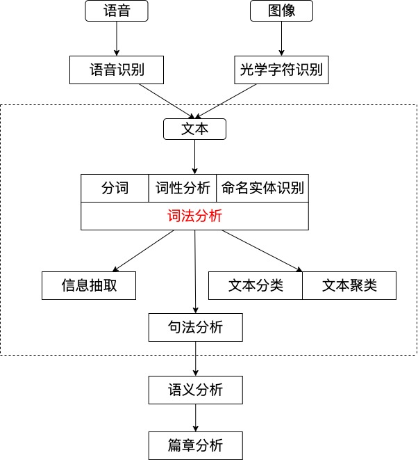
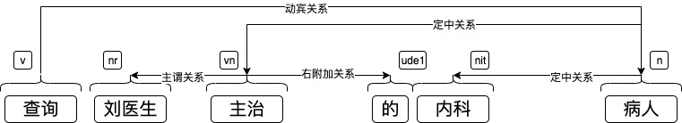

# 自然语言处理综述

自然语言处理（Natural Language Processing，NLP），又名计算语言学（Computational Linguistic，CL）或是自然语言理解（Natural Language Understanding，NLU）。是一门融合了计算机科学、人工智能以及语言学的交叉学科。这门学科研究的是如何通过机器学习等技术，让计算机学会处理人类语言，乃至实现终极目标——理解人类语言或是人工智能（图灵测试）。

## 一、自然语言与 编程语言
作为我们处理的主要对象——“自然语言”，它具备高度灵活的特点。但平时我们太过于熟悉自己的语言，所以感觉不到他的复杂。目前人类控制计算机执行任务的语言有很多，我们统称它们为“编程语言”，所以我们拿自然语言与编程语言做个对比，来看看计算机理解我们的语言有多么困难。

|        | 自然语言           | 编程语言         |
| ------ | ------------------ | ---------------- |
| 词汇量 | 非常多             | 很少（关键字）   |
| 结构化 | 非结构化           | 结构化           |
| 歧义性 | 大量歧义           | 无歧义           |
| 容错性 | 出现错误可以理解   | 必须保证绝对正确 |
| 易变性 | 很快（年度热词）   | 较慢             |
| 简略性 | 简略（“老地方见”） | 语法严格         |

## 二、自然语言处理的层次

1. 语音、图像和文本
   语音、图像和文本是自然语言处理的三个输入源，不过虽然语音和图像广受关注，但目前还是通过一定的处理（语音识别（）和光学字符识别（））转化为文本。所以针对于文本的处理就至关重要。
   
2. 分词、词性标注和命名实体识别
   这三个任务都是围绕词语进行的分析，所以统称为词法分析。词法分析的主要任务是将文本分隔为有意义的词语（**分词**），确定每个词语的的类别和浅层的歧义消除（**词性标注**），并且识别出一些较长的专有名词（**命名实体识别**）。
   
3. 信息抽取
   根据已经分好的单词和标签，抽取出一部分有用的信息。更大颗粒度的文本对用户更加友好。
   
4. 文本分类与文本聚类
   将文本拆分为一系列词语后，我们可以在文章级来做分析。
   有时我们想知道一段话是褒义还是贬义，判断一封邮件是否为垃圾文件，想把许多文档分门别类的整理一下，这些任务就叫**文本分类**。
   有时我们想把相似的文本归档到一起，或者排除重复的文档，而不关心具体的类别，此时进行的任务乘坐**文本聚类**。
   
5. 句法分析
   分析句子的结构，得到句子的主谓宾等结构，从而得到我们真正需要的部分。比如“查询刘医生主治的内科病人”这句话，用户真正想要查询的不是“刘医生”，也不是“内科”，而是“病人”。虽然这三个词语都是名词，甚至“刘医生”离表示意图的动词“查询”最近，但是只有“病人”才是“查询”的宾语。
   
   
   
6. 语义分析与篇章分析
   相较于句法分析，语义分析侧重语义而非语法。它包括词义消歧（确定一个词在语境中的含义，而不是简单的词性）、语义角色标注（标注句子中的谓语与其他成分的关系）乃至语义已存分析（分析句子中词语之间的语义关系）。

7. 其他高级任务
   - 自动问答
   - 自动摘要
   - 机器翻译

   *信息检索（Information Retrieve，IR）是区别自然语言处理的独立学科*
## 三、