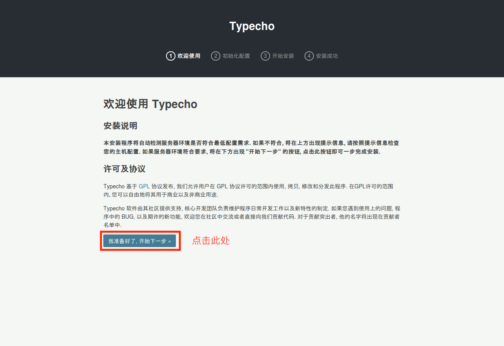
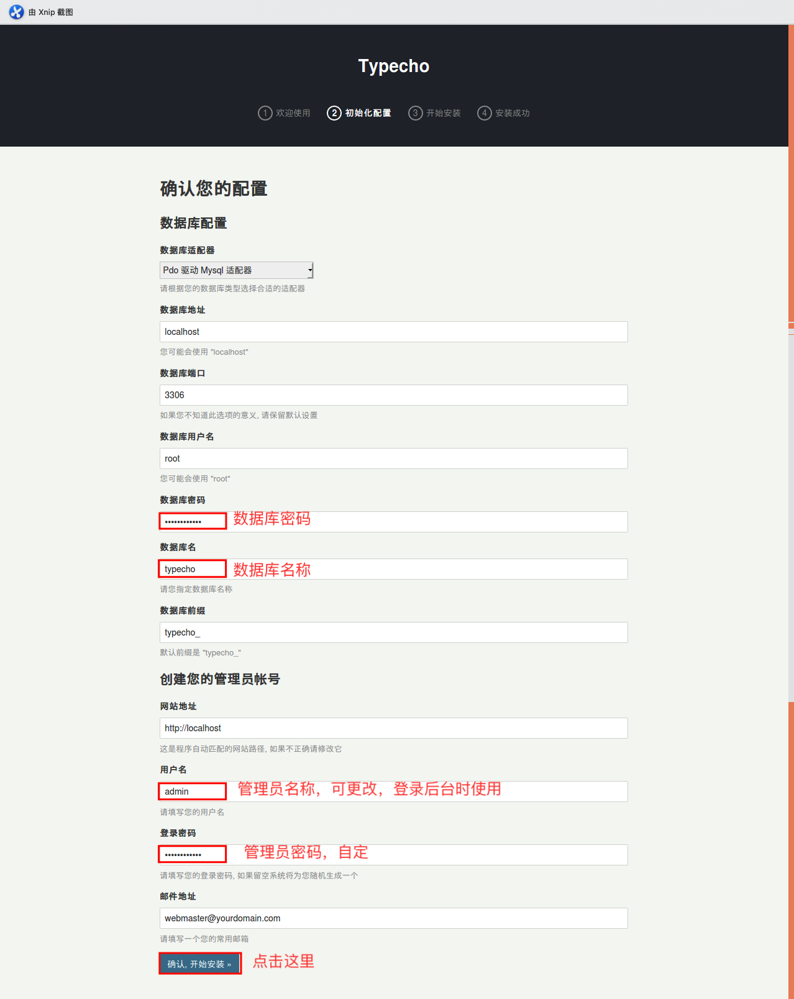
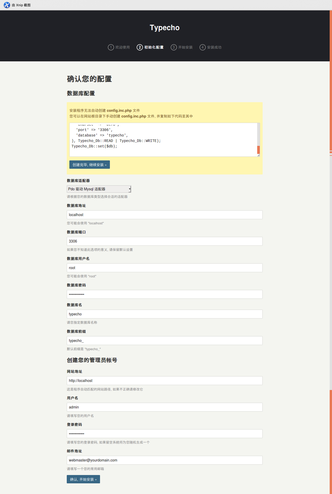
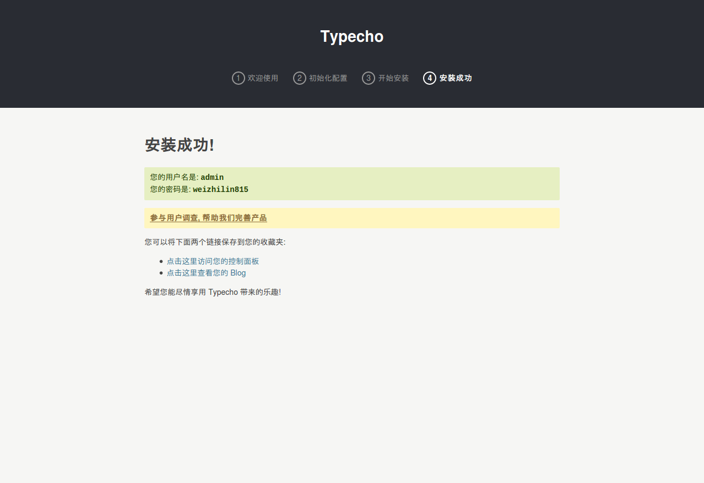

# Typecho部署云服务器流程


<!-- more-->

笔者的硬件环境是腾讯云的学生主机，基本就是最低配置的云主机。系统安装的是Ubuntu 16.04 Server，因为Linux系列以来一直使用的Ubuntu，所以就没更改其他的系统。最后说一句，千万不要用Windows Server去部署，你会发现速度超级感人！

## 一、LMAP环境的搭建

1. 安装mysql，期间会输入mysql的密码，请牢记此密码。
   `sudo apt-get install mysql-server`
2. 安装Apache
   `sudo apt-get install apache2`
3. 安装PHP及其组件
   `sudo apt install php php-dev php-curl php-pear php-mysql libapache2-mod-php php-mcrypt php-gd php-mbstring php-pdo php-sqlite3`
4. 移动至指定目录、删除多余文件夹
   ```shell
   cd /var/www
   sudo rm -r html/
   ```
## 二、Typecho下载与部署

1. 下载Typecho并解压
```shell
sudo wget -d http://typecho.org/downloads/1.1-17.10.30-release.tar.gz
sudo tar -xvf 1.1-17.10.30-release.tar.gz
sudo rm 1.1-17.10.30-release.tar.gz
```
2. 将Typecho导入/var/www目录
```shell
cd build
sudo mv * ../
cd ../
sudo rm -r build
```

## 三、配置Apache与Mysql
1. 配置Apache
   ```shell
   sudo apt install vim
   sudo vim /etc/apache2/sites-available/000-default.conf
   ```
   将其中`DocumentRoot`修改为如下
   ```xml
   <VirtualHost *:80>
   ...
     			#ServerName xxxx #此处为域名，有域名的可以填写在此处，记得删除最前面的#
           ServerAdmin webmaster@localhost
           DocumentRoot /var/www		#alter
   ```
   重启Apache服务
   ```shell
   sudo service apache2 restart
   ```
2. 创建数据库
   ```sql
   mysql -uroot -p
   输入密码
   create database typecho;
   quit;
   ```
## 四、Typecho的安装

1. 在浏览器输入公网ip，进入如下画面：
   
2. 输入配置信息
   
3. 如果出现以下画面，执行第四步，否则跳过第四步。
   
4. 执行如下命令
   ```shell
   cd /var/www
   sudo touch config.inc.php
   sudo chmod 777 config.inc.php
   sudo vim config.inc.php
   ```
   将图片提示区的代码输入其中，保存退出重新点击开始安装。
5. 出现如下图片则证明安装成功
   